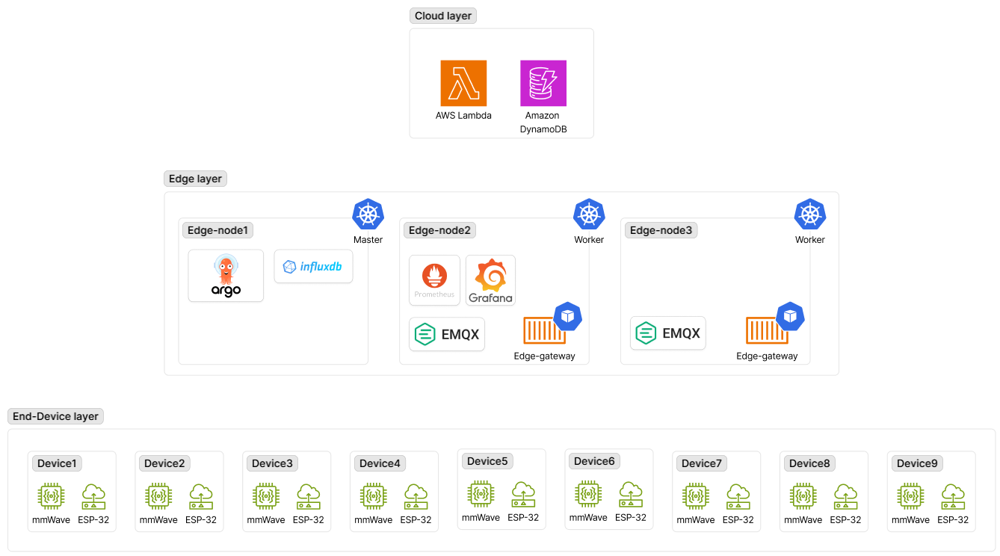

# Architecture

> 이 디렉토리의 문서, 시각화 자료는 Claude(Anthropic)를 활용해 작성됨.

## 전체 아키텍처

## 페이즈

| 페이즈 | 범위 | 상태 | 문서 |
|---|---|---|---|
| cicd | 로컬 하네스, Argo CD, GHCR | 작업 완료 | [cicd.md](cicd.md) |
| messaging | EMQX, NodePort 노출 | 작업 완료 | [messaging.md](messaging.md) |
| storage | InfluxDB | 진행 중 | [storage.md](storage.md) |
| security | step-ca, mTLS, EST | 진행 예정 | [secutiry.md](security.md) |
| pipeline | Edge Gateway, ESP32Device CRD | 진행 중 | - |
| visibility | Prometheus, Grafana, eBPF, Heartbeat | 진행 예정 | - |

