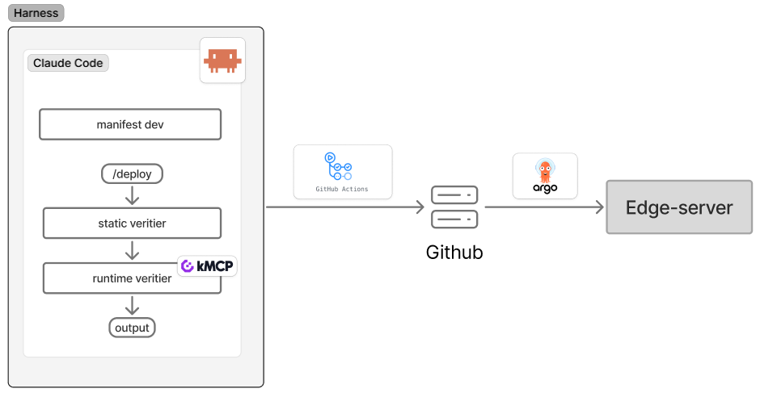

# cicd

- 작성일: 2026-05-06
- 상태: 작업 완료

## 다이어그램

## 결정 사항

### 1. CI 주체로 harness(llm) 채택, GitHub Actions는 보조 역할 (2026-05-06)

- **선택**: 정적 검증 + 런타임 검증 + 이미지 빌드(multi-arch: `linux/amd64`+`linux/arm64`, `docker buildx build --push` — `conventions.build_platforms`) + GHCR Push를 로컬 하네스가 수행. GitHub Actions는 lint/format 체크만
- **대안**: GitHub Actions가 전체 CI 담당
- **이유**: LLM 기반 코드 생성 → 정적 검증 → 런타임 검증의 폐쇄 루프를 하네스로 구축하는 것이 핵심 의의. LLM이 로컬 파일·클러스터 상태에 직접 접근하며 검증 결과를 다시 다음 단계 입력으로 받는 구조라, 외부 CI 러너로 위임하면 컨텍스트 전달 비용과 피드백 지연이 워크플로우 자체를 깨뜨림.
- **트레이드오프**: 로컬 PC 환경 의존. PC 꺼져 있으면 빌드 불가. 환경 표준화 책임은 개발자 본인 — multi-arch 빌드 호스트에 `docker-container` buildx 빌더 + binfmt/QEMU 1회 셋업 필요(Kubeharness README "사전 준비"). (업데이트 2026-05-12: 단일 arm64 빌드 → multi-arch buildx 로 전환.)

### 2. CD 주체로 Argo CD 채택 + 수동 트리거 (2026-05-06)

- **선택**: Argo CD, e-s1에 non-HA로 배포, sync는 수동 트리거
- **대안**: Flux, Argo CD auto-sync, 수동 kubectl apply
- **이유**: GitOps 표준 도구. Git이 source of truth라 Argo CD 자체 장애 시에도 매니페스트 유실 없음. 수동 트리거는 학습·개발 단계 특성상 의도치 않은 자동 배포로 인한 클러스터 상태 변경을 차단하는 안전장치
- **트레이드오프**: non-HA. Argo CD 다운 시 배포 일시 중단되나, Git 보존되어 있어 복구 후 재동기화 가능