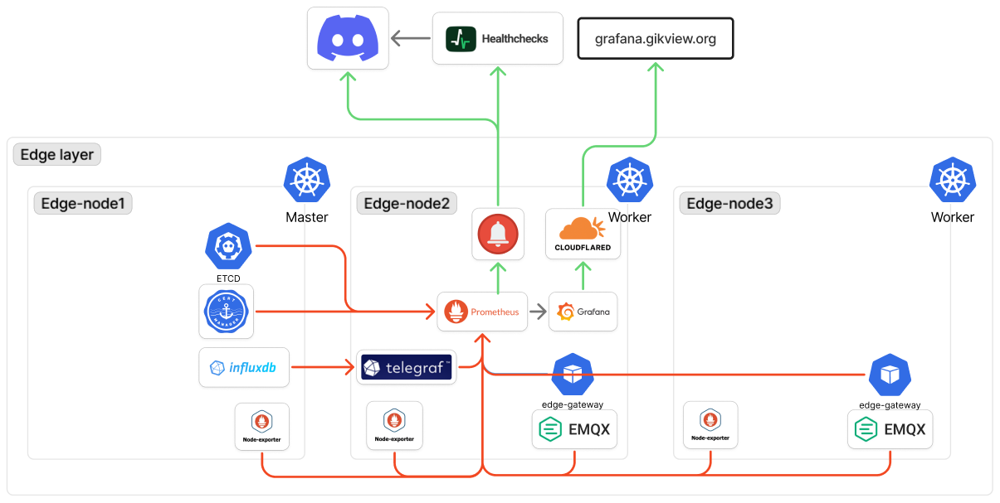

# visibility

- 작성일: 2026-06-09
- 상태: 작업 완료

edge K3s 클러스터 내부 상태 수집과 알림. 목표는 센서 데이터 파이프라인 전 구간의 가시성 확보다.
ESP8266 → EMQX → (Telegraf → InfluxDB) / (Edge Gateway → DynamoDB) 흐름에서 어느 지점이 끊겨도 감지한다.

알림 파이프 watchdog(외부 dead-man's-switch)와 Hubble 기반 네트워크 관측을 추가한다 (결정 9번).

## 다이어그램

## 결정 사항

### 1. 수집 스택: Prometheus + Alertmanager + Grafana (2026-06-09)

- **선택**: Prometheus(스크랩, alert rule) + Alertmanager(라우팅) + Grafana(시각화). Helm + ArgoCD 로 배포
- **대안**: Grafana Alloy 단독, VictoriaMetrics, 외부 SaaS(Datadog 등)
- **이유**: 본 스택 컴포넌트 대부분이 Prometheus 포맷 `/metrics` 를 네이티브 노출하고, pull 기반이라 클러스터 service discovery 와 결합된다. 외부 SaaS 는 비용과 학내망 데이터 외부 유출 문제가 있다. VictoriaMetrics 는 9 대 규모에 과설계다
- **트레이드오프**: RPi 노드 성능 한계가 제약이다. Prometheus/Grafana 는 메모리/IO 부하가 있어 data pipeline 워크로드(EMQX/Telegraf/Edge Gateway)와 같은 노드에 몰면 경합한다. 노드 하나는 비워 안정적 파이프라인과 추후 확장 여지를 확보해야 한다
- **관련**: cicd.md 결정 2, 결정 7번

### 2. retention 14일, scrape 30s, e-s2 배치 (2026-06-09)

- **선택**: Prometheus retention 14일, scrape interval 30s. Prometheus 를 e-s2 에 배치 (InfluxDB 의 e-s1 외장 SSD 와 물리 분리)
- **대안**: retention 30일+, scrape 15s, e-s1 공동 배치
- **이유**: e-s2 는 microSD 라 random write IOPS 가 낮다 (storage.md 결정 2, `260420_etcd-fsync-cascading-failure`). retention 이 길고 scrape 가 촘촘하면 TSDB compaction write 가 microSD 를 압박한다. 14일이면 단기 추세와 알림 사후 확인에 충분하고, 장기 시계열은 InfluxDB 가 무제한 보관한다 (storage.md 결정 3). 30s 는 5초 polling 데이터의 10분 freshness 알림에 충분한 해상도다
- **트레이드오프**: 14일 초과 메트릭 히스토리는 유실된다. 30s 미만 순간 스파이크는 놓칠 수 있으나 흐름 단절/추세 감지 목적에 영향이 작다
- **관련**: storage.md 결정 2·3

### 3. 센서 freshness 메트릭은 Telegraf SQL 브릿지로 (2026-06-09)

- **선택**: Telegraf 가 InfluxDB 3 Core 의 `/api/v3/query_sql` 을 `inputs.http` 로 주기 질의(`SELECT room_id, max(time) ... GROUP BY room_id`)해 `outputs.prometheus_client` 로 `gikview_sensor_last_seen_seconds{room_id}` gauge 노출. alert 는 `time() - gikview_sensor_last_seen_seconds > 600`
- **대안**: 커스텀 exporter 사이드카, EMQX per-client 메트릭
- **이유**: Prometheus 는 SQL/InfluxQL 을 실행하지 못해 데이터 레이어(per-room 최종 수신 시각)를 메트릭으로 옮기는 브릿지가 필요하다. InfluxDB 가 3.9 Core(SQL/DataFusion, `influxdb.md`)라 쿼리가 단순하고, 운영 중인 Telegraf 의 `inputs.http` + `outputs.prometheus_client` 로 신규 코드 없이 구현된다. 2.x Flux 였다면 커스텀 사이드카가 거의 유일했다
- **트레이드오프**: 질의 주기만큼 freshness 지연이 더해진다. InfluxDB write 시점 기준이라 EMQX 수신은 됐어도 write 실패 시 stale 로 잡히며, 이는 끝단까지 검증하는 의도된 동작이다
- **관련**: influxdb.md, telegraf.md, pipeline.md 결정 1

### 4. InfluxDB 용량/엔진 헬스는 네이티브 /metrics 로 (2026-06-09)

- **선택**: 디스크 증가 추이와 write/query 헬스를 InfluxDB 3 Core 네이티브 `/metrics`(8181) + node_exporter 의 e-s1 외장 SSD filesystem 메트릭으로 수집. 쿼리 불필요
- **대안**: SQL 로 row count 집계, du 기반 CronJob exporter
- **이유**: 디스크/write/query 는 엔진 레벨 메트릭이라 직접 노출된다. SSD 잔여 용량 교차검증으로 storage.md 결정 3 의 retention 재검토 근거를 확보한다. 결정 3 브릿지는 데이터 레이어 전용으로 책임을 분리한다
- **트레이드오프**: 노출 항목이 버전에 종속된다
- **관련**: 결정 3번, storage.md 결정 3

### 5. K3s etcd 메트릭 노출 활성화 (2026-06-09)

- **선택**: e-s1 K3s embedded etcd 메트릭(`:2381/metrics`)을 `--etcd-expose-metrics` 로 노출
- **대안**: etcd 메트릭 미수집
- **이유**: etcd 메트릭은 기본 노드 로컬 바인딩이라 클러스터 내 Prometheus 가 도달하지 못한다. `260420_etcd-fsync-cascading-failure` 이력이 있어 `etcd_disk_wal_fsync_duration_seconds` 등 fsync latency 관측이 재발 감지에 직결된다. e-s1 에 etcd/InfluxDB/외장 SSD 가 집중되어 IO 경합 가시화 가치가 크다
- **트레이드오프**: 메트릭 엔드포인트가 노드 IP 로 노출된다(읽기 전용). control-plane 재기동 1회 필요
- **관련**: storage.md 결정 2

### 6. 파이프라인 끝단 가시성: cert / AWS / ACL (2026-06-09)

- **선택**: 흐름을 조용히 끊는 실패 지점 3종 계측
  - cert: cert-manager `certmanager_certificate_expiration_timestamp_seconds` + controller/Reloader up. ESP8266 rekey 실패는 디바이스 내부라 EMQX active connection 수(=9)로 간접 감지
  - AWS: Edge Gateway 가 메트릭 3종(`edge_gateway_dynamodb_putitem_total{result}`, `edge_gateway_sts_refresh_total{result}`, `edge_gateway_last_write_timestamp_seconds`)을 `:9101/metrics` 로 노출. STS 실패 시 InfluxDB 적재는 계속되고 DynamoDB 쓰기만 차단되어 사용자 대면 데이터가 조용히 stale 되는데(pipeline.md 결정 2), 이 실패는 Edge Gateway 내부에서만 관측 가능해 자체 계측이 클러스터 내 유일한 신호다
  - ACL: EMQX `/api/v5/prometheus` 의 ACL deny 카운터. 위조/부트스트랩 디바이스 연결 시도가 찍힌다 (security.md 결정 12)
- **대안**: 데이터 결과(InfluxDB/DynamoDB)로만 사후 추론
- **이유**: 결과만 보면 어느 단계가 끊겼는지 진단할 수 없다. 셋은 각각 mTLS, DynamoDB 경로, 연결 인증을 조용히 끊는 단일 실패점이라 직접 계측해야 단계별 분리 진단이 된다. ACL deny 는 security.md 결정 10(데이터 레이어 이상탐지)의 messaging 계층 보완 시그널이기도 하다
- **트레이드오프**: Edge Gateway 에 metrics endpoint 코드 추가가 필요하다. Edge Gateway 는 pipeline phase 산출물이라 visibility 작업이 pipeline 산출물(소스/chart 포트/이미지)을 수정하게 되며, 재배포도 edge-pipeline phase 경로로 한다
- **관련**: security.md 결정 7·10·12, pipeline.md 결정 2

### 7. 알림 채널은 Discord webhook (2026-06-09)

- **선택**: Alertmanager receiver 를 Discord webhook 으로 설정
- **대안**: Slack, 이메일, PagerDuty
- **이유**: 운영자가 이미 쓰는 채널이라 추가 도구가 없다. 9 대 규모에 PagerDuty 급 온콜 도구는 과설계다
- **트레이드오프**: Discord/webhook 자체가 죽으면 알림 부재를 감지하지 못한다 (결정 8번)
- **관련**: 결정 8번

### 8. watchdog / heartbeat / eBPF 는 추후 합류 (2026-06-09)

- **선택**: 알림 파이프 생존 감시(watchdog/dead man's switch), 노드 heartbeat → Lambda, eBPF 관측은 이번에 작업하지 않는다. 같은 visibility 단계의 추후 작업으로 합류시킨다
- **대안**: 지금 healthchecks.io 등 외부 cron-monitor 도입
- **이유**: watchdog 의 본질은 정상 신호의 부재를 외부에서 감지하는 것이다. Discord 로만 보내면 Discord 가 죽을 때 동일하게 침묵해 무의미하다. 외부 수신처가 필요한데 예정된 heartbeat → Lambda 작업이 바로 그 역할이라, 지금 임시 외부 SaaS 를 붙였다 Lambda 로 교체하는 중복을 피한다
- **트레이드오프**: 합류 전까지 알림 파이프 전체 장애 시 사각지대가 남는다. 명시적 잔여 위험으로 둔다
- **관련**: 결정 7번

### 9. watchdog = healthchecks.io, 네트워크 관측 = Hubble (2026-06-14)

- **선택**: (a) 알림 파이프 watchdog 는 Alertmanager Watchdog alert → healthchecks.io ping (외부 cron-monitor). (b) 노드 heartbeat→Lambda 안은 폐기. (c) 네트워크 L3/L4 관측은 기존 Cilium(1.19.2)에 Hubble 활성 → metrics 를 Prometheus 스크랩 → Grafana 시각화.
- **결정 8 supersede**: 8 은 healthchecks.io 를 거부하고 Lambda 합류를 택했으나, 재검토 결과 (1) watchdog 의 유일 요건은 "신호 부재의 외부 감지"인데 healthchecks.io 가 정확히 그 전용 SaaS (무료, 인프라 0, Alertmanager built-in 연동), (2) Lambda 안은 last-seen 상태저장(DynamoDB) + 신규 함수 + 노드별 invoke 비용을 요구하는데 노드 liveness 는 NodeDown alert 가 이미 처리해 heartbeat→Lambda 가 통째로 중복. → Lambda 경로 폐기, healthchecks.io 채택.
- **트레이드오프**: 외부 SaaS 의존 추가(무료티어 check 20개 중 1개 사용, 로그 100개 한도). ping URL 은 토큰성 → Secret 주입.
- **Hubble 범위**: CNI 교체 없음(이미 Cilium). hubble.enabled + relay + metrics 플래그. Hubble UI 영구노출은 안 함(서비스 단순, Cloudflare 서브도메인 추가 회피) — 필요시 port-forward.
- **관련**: 결정 7번, 8번(supersede)

### 10. Hubble 디버깅 확장: relay + metrics context 라벨 (2026-06-14)

- **선택**: (a) hubble-relay 활성 → `hubble observe` CLI 로 연결 단위(flow-level) 디버깅. UI 는 여전히 영구노출 안 함(port-forward on-demand). (b) hubble metrics 에 sourceContext/destinationContext=workload-name|reserved-identity 추가 → 서비스쌍 단위 drop/flow 귀속. Grafana drop 패널을 source/destination 기준으로 재작성.
- **결정 9 보강**: 9 는 "relay 불필요(메트릭은 agent 직접)"라 했으나, 이는 메트릭 수집 기준이었고 **디버깅 목적(네트워크 vs app vs 스토리지 판별)**에는 집계 비율만으론 부족. 연결 단위 가시성 = relay 필요, 서비스 귀속 = context 라벨 필요. 9 의 메트릭 경로는 유지하고 디버깅 경로를 추가하는 것이라 supersede 아닌 보강.
- **트레이드오프**: relay Pod 1개 추가(경량). context 라벨로 메트릭 cardinality 소폭 ↑ (workload 소수라 e-s2 영향 미미). UI 미배포로 토폴로지 자동맵은 없음 — CLI 로 대체.
- **범위 밖**: L7(httpV2) — 트래픽이 MQTT/InfluxDB 라 HTTP 가시성 한정적, 보류.
- **관련**: 결정 9

### 11. Grafana 외부 노출은 Cloudflare Tunnel + Access (2026-06-14)

- **선택**: Grafana 외부 접근을 `cloudflared`(outbound-only 터널) + Cloudflare Access(GitHub IdP)로. Grafana 는 ClusterIP 내부 전용 유지, 유일 진입점은 터널(NodePort/Ingress 직접 노출 금지). 원격관리형 — `TUNNEL_TOKEN`(`cloudflared-token` Secret)만 클러스터에 두고, 라우팅·Access 정책은 Cloudflare 대시보드(선행 작업). `GF_SERVER_ROOT_URL` 을 `https://grafana.<domain>/` 와 일치시켜 redirect/asset 깨짐 방지. Hubble UI 등 다른 관리 UI 는 서브도메인 추가 없이 ad-hoc port-forward (결정 9번)
- **대안**: NodePort/Ingress(Nginx/Traefik) 직접 노출 + 자체 TLS·인증, Cilium L2 Announcement + LoadBalancer, Tailscale/WireGuard VPN, 상시 `kubectl port-forward`
- **이유**: inbound 포트 0 — 학내망 공유기 포트포워딩·방화벽 구멍이 불필요하다. 관리 UI 라 messaging.md 결정 3(EMQX)·security.md 결정 11(step-ca)의 디바이스-facing NodePort 노출과 달리 펌웨어 하드코딩 제약이 없어 터널이 정반대로 적합하다. Ingress 직접 노출은 인증을 자체 구현해야 하고(헤더 위조·Access 우회 위험) 공인 IP·인증서 관리 부담이 따른다. L2 Announcement 는 단일 control-plane 에서 apiserver SPOF(messaging.md 결정 3 동일 근거). Access(GitHub IdP)가 엣지에서 인증을 종료해 Grafana 앞단은 무인증 평문 노출이 0 이다. 데이터 경로는 egress QUIC(UDP 7844)만 쓰고, 학내망이 UDP 를 막으면 `http2`(TCP 443) 폴백
- **트레이드오프**: Cloudflare 외부 의존 추가 — 터널이 죽으면 Grafana 접근만 끊기고 데이터 수집·알림 경로(Prometheus/Discord/healthchecks)는 무관하다. 원격관리형이라 라우팅·Access 가 git 밖(Cloudflare 대시보드 상태)이라 GitOps SoT 밖 운영 사실이 생긴다. cloudflared `--metrics 0.0.0.0:2000`(`/ready`·`/metrics`)은 클러스터 내부 진단 전용이며 터널로 외부 노출되지 않는다(inbound 0 유지) — smoke 가 `/ready` 로 터널 연결을 검증한다. replica 2 무중단(RPi 부하 시 1)
- **관련**: 결정 9번, messaging.md 결정 3, security.md 결정 11, `context/knowledge/cloudflare-tunnel.md`, `context/knowledge/grafana.md`
