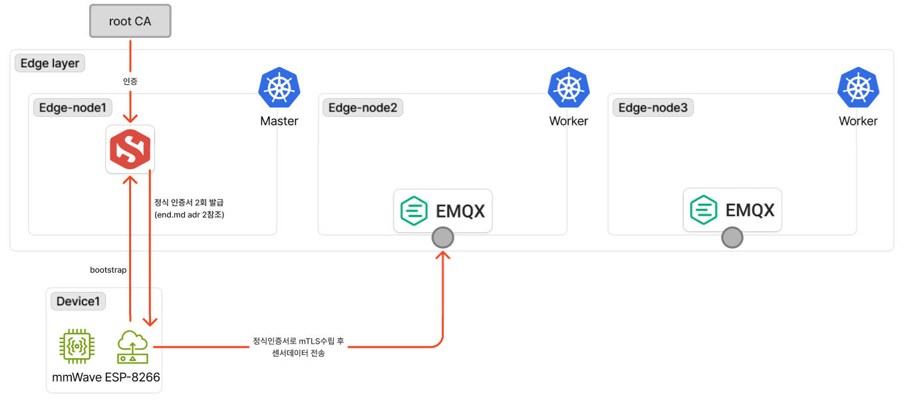

# end

- 작성일: 2026-05-19
- 상태: 작업 완료

ESP8266 펌웨어의 결정사항. 시스템 차원의 PKI/messaging 설계는 [security.md](security.md), [messaging.md](messaging.md) 참조.

## 다이어그램

## 결정 사항

### 1. PKI 라이브러리 조합 (2026-05-17)

- **선택**: BearSSL (TLS) + uECC (P-256 키 생성·서명) + 자체 ASN.1 DER 인코더 (CSR / EC private key DER 구성)
- **대안**: BearSSL 단독, mbedTLS 포팅, ArduinoBearSSL + 보조 라이브러리
- **이유**: ESP8266 Arduino core 에 내장된 BearSSL 은 TLS 클라이언트는 지원하지만 키페어 생성 / CSR / EST 흐름은 미제공. uECC 는 P-256 ECDSA 만 다루는 작은 라이브러리로 ESP8266 메모리(50KB heap 대) 에 맞음. CSR/EC priv key 구조는 ASN.1 DER 표준이라 직접 인코딩이 단순. mbedTLS 포팅은 보드 표준 빌드와 충돌. ArduinoBearSSL 은 같은 BearSSL 래퍼라 추가 이득 없음
- **트레이드오프**: ASN.1 빌더 직접 유지보수. 단 X.509 표준 구조는 안정적이라 변경 빈도 낮음. uECC RNG 는 ESP8266 의 `RANDOM_REG32` 에 의존
- **관련**: [context/knowledge/step-ca.md](../../context/knowledge/step-ca.md) "펌웨어 측 PKI 라이브러리" 절

### 2. 부트스트랩에서 2단계 발급 패턴 (2026-05-19)

- **선택**: 첫 부팅 시 X5C JWT 발급을 2회 연속 호출.
  - 1차: signer = bootstrap cert, aud = `#x5c/device-bootstrap`. 결과 cert 의 provisioner-extension = `device-bootstrap`
  - 2차: signer = 1차 cert, aud = `#x5c/device-renewal`. 결과 cert 의 provisioner-extension = `device-renewal`
  - 2차 cert 를 LittleFS 에 저장. 부트스트랩 자산 삭제 후 reboot
- **대안**: 1단계 발급만 사용 (security.md 결정 4번의 원안), step-ca chart 의 `device-bootstrap.disableRenewal` 을 false 로 변경
- **이유**: step-ca 의 mTLS rekey (`/1.0/rekey`) 는 cert 의 provisioner-extension 으로 발급 provisioner 를 매칭한 뒤 그 provisioner 의 `AuthorizeRenew()` 를 호출함. `device-bootstrap` 은 `disableRenewal: true` 라 그 cert 로는 rekey 불가. 운영 cert 의 ext 를 `device-renewal` 로 두기 위해 2단계 발급. chart 의 disableRenewal 정책을 약화하는 대안은 security.md 결정 4번의 보안 의도와 충돌
- **트레이드오프**: 부팅 시 step-ca POST 2회 발생 (각 ~2-3초). 2차 발급은 X5C `forbiddenAfter` 정책 적용 대상이라 새 cert notAfter 가 signer notAfter 를 넘으면 거부. 1차 발급 직후 호출이라 signer 잔여 ≈ 전체이지만, client 측에서 `min(요청값, signer_notAfter - 60s)` 로 클램프 적용해 안전 마진 확보
- **관련**: security.md 결정 4번 (보강 사항)

### 3. mTLS rekey 채택 (2026-05-19)

- **선택**: 정식 cert 갱신을 `/1.0/rekey` + mTLS 로 호출. body 는 `{"csr": "<new CSR PEM>"}` 만, JWT 불사용. 새 키페어로 회전
- **대안**: `/1.0/renew` (같은 key 재사용, body 없음), `/1.0/sign` + X5C JWT (`#x5c/device-renewal`)
- **이유**: `/1.0/sign` + X5C 는 forbiddenAfter 정책 적용으로 매 갱신마다 cert lifetime 이 signer 잔여만큼 짧아져 사이클이 안정되지 않음. `/1.0/rekey` 는 mTLS 인증이라 forbiddenAfter 미적용, 옛 cert duration 을 유지한 채 NotBefore 만 now 로 옮겨 발급. `/1.0/renew` 도 같은 동작이나 key rotation 미지원 (RekeyRequest 와 달리 RenewRequest 는 body 없음). 매 갱신 시 키 회전이 보안 best practice 라 rekey 채택
- **트레이드오프**: HTTPClient 라이브러리 사용 불가. URL 의 host 가 BearSSL `server_name` 으로 강제 들어가 SAN 매칭이 시도되는데, ESP8266 환경에서는 DNS 정적 매핑 불가 (결정 4번 참조) 라 매번 실패. 따라서 raw `WiFiClientSecure` 로 HTTP/1.1 요청을 직접 작성
- **관련**: [smallstep/certificates ca package](https://pkg.go.dev/github.com/smallstep/certificates/ca) (RekeyRequest)

### 4. SAN 매칭 우회 (IP connect + chain-only) (2026-05-19)

- **선택**: 모든 외부 호출 (step-ca, EMQX) 을 IP 로 connect. `setTrustAnchors(rootCA)` 로 Root CA 체인 검증은 유지하되, BearSSL 의 hostname/SAN 매칭은 스킵
- **대안**: lwIP `dns_local_addhost()` 로 정적 hostname↔IP 매핑 후 hostname connect, 학내망에 mini DNS 서버 추가, `setInsecure()` 로 trust 자체 무력화
- **이유**: 대안들이 부적합하거나 과도.
  - `dns_local_addhost`: ESP8266 Arduino lwIP2 의 `DNS_LOCAL_HOSTLIST` / `DNS_LOCAL_HOSTLIST_IS_DYNAMIC` 매크로 0 으로 설정되어 헤더에서 노출 안 됨
  - lwipopts.h 패치: 코어 업데이트 시 손실 + 다른 sketch 사이드이펙트
  - 학내 DNS 추가: 인프라 범위 작업
  - `setInsecure`: chain 검증까지 끄는 과도한 약화

  `connect(IPAddress, port)` 경로는 BearSSL `server_name` 이 NULL → SAN 매칭만 스킵, chain 검증은 정상 수행. 위협 모델 (security.md 결정 6번) 의 네트워크 계층 공격에 대해 Root CA 체인 만족하는 cert 만 신뢰하는 보장은 유지
- **트레이드오프**: 같은 Root CA 체인을 만족하는 다른 cert (예: cert-manager 가 다른 워크로드에 발급한 cert) 로의 사칭은 차단되지 않음. ACL 이 CN 을 username 으로 매핑해 권한 분리하므로 (security.md 결정 5번) 추가 권한 상승은 불가
- **관련**: security.md 결정 11번 (BearSSL IP SAN 미검증), step-ca server cert dnsNames 결정

### 5. BearSSL TLS 버퍼 크기 (2026-05-19)

- **선택**: EMQX mqtts 용 RX 4096B / TX 2048B. step-ca HTTPS 용 RX 4096B / TX 2048B (mTLS rekey 시) 또는 4096B / 512B (단방향)
- **대안**: 기본 16KB / 16KB, 1024B / 1024B
- **이유**: BearSSL 의 `setBufferSizes()` 는 연속된 heap 블록을 alloc 함. ESP8266 의 50KB 가용 heap 에서 16KB 연속 블록은 fragmentation 환경에서 종종 실패 (`ssl=-1000` BearSSL OOM). 실제 핸드셰이크 한 flight (ServerHello + Cert chain + KX + CertReq + HelloDone) 가 EMQX 의 경우 약 2KB, step-ca 의 경우 약 1.5KB. mTLS 시 client cert chain 송신 약 1KB. 실측 필요량의 2배 정도로 잡으면 안전
- **트레이드오프**: 단일 record 가 4KB 를 초과하는 비표준 cert chain 은 처리 불가. 운영 cert chain 은 leaf + Intermediate 약 1KB 로 충분
- **관련**: [BearSSL bearssl_x509.h](https://www.bearssl.org/apidoc/bearssl__x509_8h.html)

### 6. 갱신 시 mqtt 세션 일시 teardown (2026-05-19)

- **선택**: `/1.0/rekey` 호출 직전에 mqtt 세션을 명시적으로 끊고 BearSSL X509List / PrivateKey 객체를 delete. 갱신 성공 후 새 cert chain 으로 `setup_operational()` 재호출
- **대안**: mqtt 세션 유지한 채 rekey 시도, mqtt 와 step-ca 가 같은 BearSSL 인스턴스 공유
- **이유**: mqtt 세션이 alive 인 상태에서 X509List 2개 + PrivateKey 1개 + TLS RX/TX 버퍼 6KB 가 heap 7-8KB 를 차지. 그 위에 rekey 의 BearSSL alloc 4KB + 2KB 가 추가되면 ESP8266 의 50KB heap 에서 fragmentation 으로 실패. teardown 으로 7-8KB 회복 후 rekey 진행. rekey 후 새 cert 로 mqtt 재핸드셰이크가 어차피 필요하므로 세션 유지에 큰 이득 없음
- **트레이드오프**: 갱신 사이클당 약 5-10초의 publish 공백 발생. publish 주기 5초라 1-2 메시지 손실. QoS 0 + InfluxDB last-seen 기반 모니터링이라 허용 범위
- **관련**: 결정 3 (rekey 흐름)

### 7. NTP 동기 timeout (60s) 후 reboot (2026-05-19)

- **선택**: 부팅 시 `time(nullptr) >= 1700000000` 까지 대기하되, 60s 가 지나면 `ESP.restart()`
- **대안**: 무한 대기, fail 모드 진입 후 idle
- **이유**: X.509 validity 검증과 JWT iat/nbf/exp 모두 정확한 시각이 필요. NTP 동기 못 하면 정식 cert 발급 자체가 불가. 외부 NTP (pool.ntp.org / time.nist.gov) 도달 실패 시 setup() 가 빠져나가지 못해 디바이스가 "전원은 켜있지만 침묵" 상태로 멈춤. timeout + reboot 로 자동 복구 시도
- **트레이드오프**: 일시적 네트워크 장애 시 reboot 루프 발생 가능. ESP8266 의 reboot 비용 (1-2초) 이 작아 누적 비용 낮음
- **관련**: 없음

### 8. 부트스트랩 실패 시 60s 후 reboot (2026-05-19)

- **선택**: BOOTSTRAP 모드의 `provision_cert(false)` 실패 시 60s delay 후 `ESP.restart()`
- **대안**: 실패 후 멈춤 (loop idle), 무한 retry, exponential backoff
- **이유**: step-ca 의 일시적 다운 (예: mapping-generator 가 `step-ca-whitelist` ConfigMap 을 갱신하면 Reloader 가 step-ca StatefulSet 을 rollout 시키고 그 동안 5-10초 발급 거부 윈도우 발생), 네트워크 일시 단절 등 회복 가능한 케이스에서 자동 복구. 부트스트랩 자산은 provision_cert 성공 후에만 삭제되므로 reboot 후 동일 흐름 재시도 가능, brick 위험 없음
- **트레이드오프**: 회복 불가능한 실패 (예: 화이트리스트에 영구 미등록) 시에도 60s 마다 reboot 반복. 운영자가 시리얼 모니터로 보면 패턴 파악 가능
- **관련**: security.md 결정 5번 (mapping-generator)

### 9. 시리얼 로그 페이로드 마스킹 (2026-05-19)

- **선택**: `publish_occupancy()` 의 시리얼 로그에 페이로드 본문 출력 안 함. topic + size + 결과만 (`[pub] sensors/<cn>/occupancy (89B, ok=1)`)
- **대안**: 디버그용 페이로드 전체 출력 유지
- **이유**: 시리얼은 디바이스에 물리적으로 케이블만 연결하면 누구나 보는 평문 채널. 페이로드에는 `bssid`, `rssi`, `timestamp` 같은 필드가 들어가 누설 시 디바이스 위치 정보 추정 가능. 운영 가시성은 InfluxDB / Grafana 로 충분. 디버깅에 페이로드 필요한 경우 펌웨어 측 토글로 일시 활성화
- **트레이드오프**: 페이로드 형식 검증을 시리얼만 보고는 못 함. 시작 시 한 번 또는 EMQX 측 로그로 대체
- **관련**: 없음

### 10. mqtt 진입 전 direct TLS probe (2026-05-19)

- **선택**: `setup_operational()` 의 PubSubClient connect 호출 직전에 `WiFiClientSecure` 로 단독 TLS 핸드셰이크 1회 시도 후 stop. 결과를 `getLastSSLError` 로 시리얼 로그에 기록
- **대안**: PubSubClient 만 사용, 진단 코드 제거
- **이유**: PubSubClient 의 connect 실패는 `mqtt.state = -2` (CONNECT_FAILED) 한 가지로 묶여 BearSSL 의 정확한 ssl 코드 추출이 어려움. direct probe 로 TLS 단의 성공/실패를 분리 진단. 같은 mTLS 설정이라 정상 운영에서도 큰 부담 없음 (핸드셰이크 ~2-3초 추가)
- **트레이드오프**: mqtt 진입 전 핸드셰이크 1회 추가 (publish 시작까지 ~2.5초 지연). 운영에서 빼고 싶으면 `#if` 토글로 가능하지만 진단 가치가 더 큼
- **관련**: 없음
