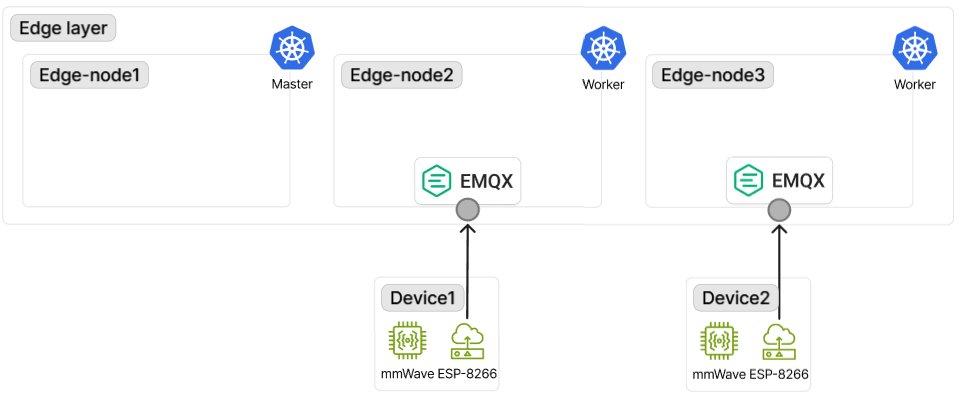

# messaging

- 작성일: 2026-05-06
- 상태: 작업 완료

## 다이어그램

## 결정 사항

### 1. MQTT broker로 EMQX 채택 (2026-05-06)

- **선택**: EMQX 5.8.6, StatefulSet 2 Pod (e-s2/e-s3) active-active
- **대안**: Mosquitto, Kafka
- **이유**: EMQX는 native clustering으로 inter-pod 라우팅 자동 처리. Mosquitto는 bridge 수동 설정 필요해 운영 복잡도 증가. Kafka는 9개 디바이스 + 5~10초 폴링 규모에서 아키텍처 과잉
- **트레이드오프**: 단일 브로커 대비 메모리 사용 증가.(HA를 위해 감수할만한 수치)

### 2. EMQX를 worker node에 고정 (2026-05-06)

- **선택**: e-s2/e-s3 두 worker 노드에만 배치, e-s1(control-plane) 제외
- **대안**: 3노드 전체 분산
- **이유**: e-s1부하 집중 해소가 목표이며, 추후 sequrity작업까지 끝낸 이후에 부하를 확인한 후 재결정 예정.
- **트레이드오프**: 노드 2대 이상 장애시 서비스 운영 중단 가능성.

### 3. 진입점으로 NodePort 직접 노출 (2026-05-06)

- **선택**: e-s2/e-s3에 NodePort 8883 직접 노출, 공유기 포트포워딩으로 분기
- **대안**: Cilium L2 Announcement, MetalLB
- **이유**: 단일 control-plane 토폴로지에서 L2 Announcement는 K8s apiserver 의존성으로 SPOF 형성. ESP32 펌웨어에 Store-and-Forward + 재연결 로직 존재해 노드 IP 노출의 단점을 흡수 가능. 노드 IP가 정적이라 펌웨어 하드코딩이 운영상 무리 없음
- **트레이드오프**: 노드 교체 시 ESP32 펌웨어 재배포 필요
- **변경 이력**: 3-server HA → 단일 control-plane 토폴로지로 변경되며 L2 Announcement의 apiserver 의존성이 SPOF로 부각되어, Cilium L2 Announcement → NodePort.로 변경.
관련: [troubleshooting/260420_etcd-fsync-cascading-failure](../troubleshooting/260420_etcd-fsync-cascading-failure/)

### 4. Shared Subscription with sticky strategy 채택 (2026-05-06)

- **선택**: EMQX `mqtt.shared_subscription_strategy: sticky`. Edge Gateway는 `$share/edge-gw/sensors/+/occupancy`로 구독
- **대안**: K8s Lease 기반 leader election + 단일 active pod 구조, round_robin 전략
- **이유**: sticky는 publisher connection 단위로 같은 subscriber에 일관 라우팅. 같은 ESP32의 메시지가 항상 같은 Edge Gateway pod로 가므로 인메모리 상태(occupancy 캐시) 동기화 불필요. K8s leader election에 의존하지 않고 active-active 분산 처리 가능
- **트레이드오프**: ESP32 재연결 시 sticky 상태 reset되어 다른 pod로 라우팅될 수 있음. 받은 pod이 InfluxDB lookup으로 상태 복원해야 함