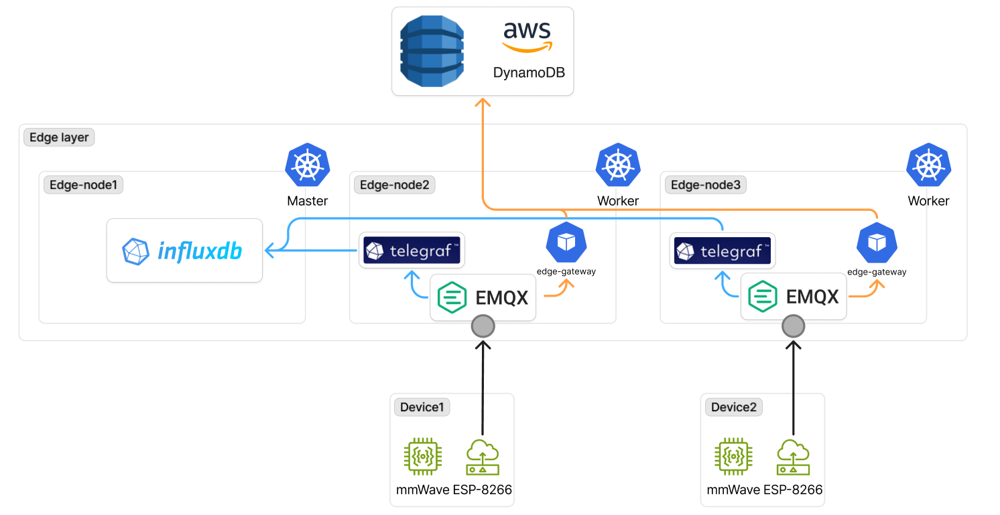

# pipeline

- 작성일: 2026-06-03
- 상태: 작업 완료

## 다이어그램

## 결정 사항

### 1. Telegraf 와 Edge Gateway 를 분리한 두 워크로드로 (2026-05-19)

- **선택**: 동일 MQTT 토픽을 share group 만 다르게 (`$share/telegraf/...`, `$share/edge-gw/...`) 구독하는 두 Deployment 로
분리. Telegraf 는 raw timeseries → InfluxDB write, Edge Gateway 는 상태 변경 감지 → DynamoDB upsert
- **대안**: 단일 워크로드(Edge Gateway)가 두 적재를 모두 수행, Telegraf 단독 + Telegraf processor 가 상태 변경까지 검출
- **이유**: SRP(단일 책임). Telegraf 는 timeseries 적재에 검증된 도구 — `outputs.influxdb_v2` + `processors.lookup` 만으로
무코드 처리. 상태 변경 감지(인메모리 캐시, 캐시 복원, IAM Roles Anywhere 자격증명 갱신) 로직을 한 워크로드에 합치면 둘 다
흔들림 — Telegraf 장애가 DynamoDB 쓰기에 전파, 반대도 동일. share group 분리 + sticky strategy(messaging.md 결정 4) 로 양쪽
모두 active-active 가능
- **트레이드오프**: 두 컴포넌트 운영. 단 의존 관계 없음(상호 호출 0) → 독립 rollout, 독립 장애 격리

### 2. AWS 자격증명으로 IAM Roles Anywhere 채택 (2026-06-02)

- **선택**: 정적 access key 미사용. step-ca 발급 디바이스/워크로드 인증서(`edge-gateway-tls` Secret) 를 IAM Roles Anywhere
trust anchor 에 등록 → `aws_signing_helper credential-process` 가 mTLS 로 STS 호출 → 임시 자격증명(1h TTL) 발급 → AWS SDK 가
`credential_process` 로 자동 갱신
- **대안**: IAM User access key + Secret 마운트, EKS IRSA, Pod Identity Webhook
- **이유**: 정적 access key 는 K8s Secret 또는 NVS 에 평문 저장 → 유출 시 즉시 차단 메커니즘 부재(CRL 미도입과 동일 사유,
security.md 결정 7). IRSA/Pod Identity 는 EKS 전용. IAM Roles Anywhere 는 onprem K8s 에서도 X.509 trust anchor 만 있으면 동작.
이미 step-ca PKI 인프라(security.md) 가 있어 추가 비용 0 — 같은 cert 를 EMQX mTLS + AWS auth 양쪽에 재사용
- **트레이드오프**: trust anchor 등록은 AWS Console 수동 작업(웹서비스팀). 첫 부팅 시 STS 도달 실패하면 자격증명 미발급 →
DynamoDB 쓰기 차단(InfluxDB 적재는 계속됨, 역할 분리 효과). dev 환경은 trust anchor 미등록 → STS 가
`TrustAnchorNotFound`/`AccessDenied` 반환, smoke 는 config 정합성만 검증

### 3. aws_signing_helper 바이너리를 멀티스테이지 빌드로 이미지에 내장 (2026-06-02)

- **선택**: 업스트림 prebuilt 바이너리(`rolesanywhere.amazonaws.com/releases/<ver>/<arch>/Linux/aws_signing_helper`) 를
Dockerfile signing-helper 스테이지에서 download → 런타임 스테이지로 COPY. arch=amd64+arm64 둘 다 동일 패턴
- **대안**: 사이드카 컨테이너로 helper 분리, initContainer 가 emptyDir 에 stage, 소스 cross-compile (`go build`)
- **이유**: helper 는 SDK 의 `credential_process` 가 fork 로 호출하는 단순 CLI — 사이드카는 IPC 메커니즘 필요(unix socket)로
오버엔지니어링. initContainer 는 매 Pod 재시작마다 동일 바이너리 복사 → 불필요한 I/O. 소스 cross-compile 은
`github.com/miekg/pkcs11` 가 CGO 필요(`CGO_ENABLED=0` 에선 `undefined: pkcs11.*` 컴파일 실패) → arm64 cross-compile 시
musl/glibc 크로스 툴체인 셋업 부담. 업스트림 prebuilt 가 정답
- **트레이드오프**: 업스트림 바이너리는 glibc 동적 링크 → alpine(musl) 런타임에서 ENOENT(loader not found). 런타임 스테이지에
`gcompat` 패키지 추가로 해결 (결정 9). 버전 업그레이드 시 Dockerfile `ARG SIGNING_HELPER_VERSION` 만 bump

### 4. IAM Roles Anywhere ARN 3개 + region 을 ConfigMap 없이 env 직접 주입 (2026-06-02)

- **선택**: `TRUST_ANCHOR_ARN`, `PROFILE_ARN`, `ROLE_ARN`, `AWS_DEFAULT_REGION` 을 `values-<env>.yaml` → Deployment `env` 로
직접 주입. ConfigMap 미사용
- **대안**: ARN ConfigMap 분리, AWS Secrets Manager 동적 조회
- **이유**: ARN 변경 빈도 ~0 (trust anchor·profile·role 은 AWS Console 에서 생성 후 회전 거의 없음). ConfigMap 경유는
GitOps(ArgoCD) 하에서 `kubectl edit` 즉시 적용 이득 없음 — values 변경 → ArgoCD sync 가 동일 흐름. ARN 은 식별자 평문이라
Secret 강제 안 됨. env 직접 주입이 가장 단순(values 한 줄 = 운영 사실 한 개)
- **트레이드오프**: dev/prod 가 다른 AWS 계정·trust anchor 사용 시 `values-dev.yaml`/`values-prod.yaml` 양쪽 유지. ARN 변경 시
Deployment rollout 1회 — Reloader annotation 미부착(Secret/ConfigMap 만 watch)

### 5. 상태 캐시는 인메모리 + InfluxDB last() 로 복원 (2026-05-19)

- **선택**: Edge Gateway pod 별 `map[room_id]occupied` 인메모리 캐시. pod 재시작/share group takeover 시 첫 메시지 수신 시점에
InfluxDB `last(_field == "occupied") where room_id == "..."` 쿼리로 복원. 외부 상태 저장소(Redis/Consul/raft) 없음
- **대안**: Redis 외부 캐시, K8s Lease + 단일 active pod, 분산 합의(raft)
- **이유**: sticky strategy(messaging.md 결정 4) 가 같은 publisher 의 메시지를 같은 pod 으로 보장 → pod 간 캐시 동기화 불필요.
인메모리 캐시 miss 는 (1) pod 재시작 직후, (2) ESP8266 재연결로 sticky reset 됐을 때만 발생 — InfluxDB `last()` 한 번이면
복원. Redis 추가는 또 하나의 stateful 컴포넌트(외장 SSD 의존 + 가용성 관리) → security/storage phase 와 무관한 부담. K8s Lease
는 활성 pod 1개로 active-active 분산 손실
- **트레이드오프**: 캐시 miss 윈도우(pod 재시작 후 첫 메시지 수신까지) 동안 InfluxDB read latency 가 처리 latency 에 더해짐.
InfluxDB 장애 + pod 재시작 동시 발생 시 캐시 미복원 → 모든 메시지를 "상태 변경" 으로 오판 → DynamoDB overwrite 중복(부작용
없음, PutItem 이라 멱등)

### 6. DynamoDB 스키마: room_id PK only, overwrite (2026-06-02)

- **선택**: 테이블 `gikview-rooms`, PK = `room_id` (String), SK 없음. attributes = `occupied`(Boolean) + `timestamp`(String,
RFC3339). 작업 = `PutItem` 으로 멱등 overwrite. 시계열 히스토리는 DynamoDB 에 두지 않음
- **대안**: PK=room_id + SK=timestamp 로 시계열 보존, GSI 추가, `bssid`/`rssi`/`device_id` 까지 저장
- **이유**: 서비스 동선이 "방의 현재 상태 조회" 단일 — 사용자에게 노출되는 정보는 최신 occupied 하나. 시계열 히스토리는
storage.md 결정 1 에서 InfluxDB 책임으로 분리 결정. SK 추가는 read 모델(웹서비스팀 API GW + Lambda) 복잡도만 증가.
`bssid`/`rssi`/`device_id` 는 디바이스 진단용이라 InfluxDB tag/field 로 충분
- **트레이드오프**: DynamoDB 만 보면 과거 상태 추적 불가 — 반드시 InfluxDB 와 함께 봐야 함. PutItem overwrite 라 conflict
resolution 부재(다른 pod 동시 쓰기 시 timestamp 역행 가능) — sticky strategy 가 동시 쓰기 자체를 거의 차단, 5초 polling 주기상
충돌 확률 낮음

### 7. AWS 책임 분기: write=Edge Gateway 직접, read=웹서비스팀 API GW + Lambda (2026-06-02)

- **선택**: Edge Gateway → DynamoDB `PutItem` 직접 호출 (Lambda 우회). 사용자 read 경로는 웹서비스팀 소유 API Gateway +
Lambda(JWT 검증) → DynamoDB Query
- **대안**: write 도 API Gateway + Lambda 경유, 양 경로 모두 Lambda 단일화
- **이유**: write 트래픽은 분당 ~9건(디바이스 9대 × 5초 폴링 중 상태 변경만 → 분당 한 자릿수). Lambda 경유는 cold start
latency + 비용 + 인증 흐름 한 단계 추가 — IAM Roles Anywhere 임시 자격증명으로 DynamoDB 직접 권한 부여가 더 직접적. read 는
만남
- **트레이드오프**: Edge Gateway 에 DynamoDB 쓰기 IAM 권한 부여 — role 정책으로 테이블/액션 좁힘(`PutItem` on `gikview-rooms`
only). 인프라팀이 직접 AWS SDK 코드 maintain — 웹서비스팀 책임 분리 명확

### 8. Telegraf 1.38 + outputs.influxdb_v2 채택 (2026-06-02)

- **선택**: Telegraf 1.38 시리즈, `outputs.influxdb_v2` 플러그인으로 InfluxDB 3 Core 의 v2 HTTP write API 호출.
`outputs.influxdb_v3` 신플러그인 미사용
- **대안**: 자체 Go consumer 로 Telegraf 대체, `outputs.influxdb_v3` 플러그인
- **이유**: 자체 consumer 는 input(mqtt) + processor(lookup, regex, converter) + output(http write) 을 모두 직접 구현 —
Telegraf 가 무코드로 제공하는 영역. `outputs.influxdb_v3` 는 동일 1.38 시리즈에 존재하나 출시 후 안정화 기간 짧음, v2 경로는
InfluxDB 1.x/2.x/3.x 전체에 검증된 표준 — 3 Core 도 v2 write API 호환 유지
- **트레이드오프**: org 필드는 InfluxDB 3 Core 미지원이라 `org=""` 처리 필요 — Telegraf 설정에 명시. v3 native 플러그인이
정착되면 마이그레이션 재평가

### 9. alpine 런타임 + gcompat 으로 glibc 바이너리 호환 (2026-06-02)

- **선택**: 런타임 베이스 `alpine:3.20` 유지, `apk add gcompat` 으로 glibc 호환 shim 설치. AWS 업스트림 prebuilt
`aws_signing_helper` (glibc 동적 링크) 가 alpine(musl) 환경에서 동작
- **대안**: Debian/Ubuntu 베이스 전환, distroless glibc 이미지(`gcr.io/distroless/cc`), 정적 링크 바이너리 자체 빌드
- **이유**: alpine 은 mapping-generator·step-ca 등 다른 자체 빌드 이미지와 일관 — 패키지 매니저(apk), 사용자 추가(`adduser
-S`) 패턴 통일. Debian 전환은 이미지 크기 ~5배(50MB → ~250MB), apk vs apt 운영 패턴 분리, ca-certificates 위치 차이 등
보일러플레이트 증가. `gcompat` 는 ~150KB 추가로 glibc 동적 의존성을 musl loader 가 해석 — AWS helper 같은 단순 CLI 에 충분.
정적 링크는 결정 3 의 CGO 문제와 동일
- **트레이드오프**: gcompat 가 glibc 풀 호환 아님 — 복잡한 NSS/threading API 쓰는 바이너리는 미지원 가능성. AWS helper 는 단순
HTTP+TLS+JSON 처리라 영향 없음. helper 버전 업그레이드 시 호환성 재확인 필요
- **변경 이력**: 초기 시도: 업스트림 소스를 alpine 골랭으로 `CGO_ENABLED=0` cross-compile → `pkcs11` 패키지가 CGO 요구라
컴파일 실패. 차선: prebuilt 다운로드 → musl loader 가 glibc 동적 의존성 못 잡아 `ENOENT` (sh "not found", exit 127). 최종:
prebuilt + gcompat shim 으로 alpine 유지
- **관련**: 결정 3