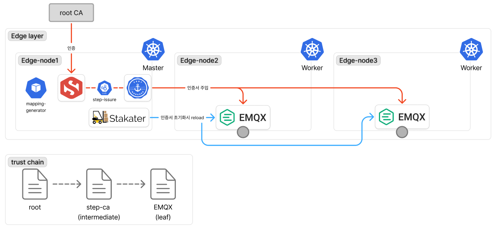

# security

- 작성일: 2026-05-06
- 상태: 진행 예정

## 다이어그램

 <!-- TODO: Root CA → step-ca → broker/Edge Gateway/디바이스 인증서 발급 경로. 부트스트랩 → EST → 정식 인증서 흐름. ACL Generator CronJob이 device-room-mapping에서 emqx-acl + step-ca-whitelist 두 ConfigMap 자동 생성하는 흐름 -->

## 결정 사항

### 1. 디바이스 인증으로 mTLS 채택 (2026-05-06)

- **선택**: ESP32 ↔ EMQX 통신에 mTLS (양방향 인증서 검증)
- **대안**: 단방향 TLS + username/password, JWT
- **이유**: 학내망에 누구나 접근 가능 → 클라이언트 인증 필수. 단방향 TLS는 위조 ESP32가 false occupancy 주입 가능. 사용자명/비밀번호는 펌웨어 추출 시 평문 노출. mTLS는 디바이스별 인증서로 침해 격리 가능
- **트레이드오프**: PKI 운영 부담 추가 (CA 운영, 인증서 갱신 메커니즘). 학습 가치 + 보안 이득으로 정당화. 물리적 디바이스 탈취는 mTLS만으로 막지 못함

### 2. PKI 서버로 step-ca 채택 (2026-05-06)

- **선택**: step-ca를 Intermediate CA로 운영. Helm chart, e-s1 K3s Pod
- **대안**: HashiCorp Vault PKI, OpenSSL 자체 CA, AWS Private CA, Let's Encrypt(ACME)
- **이유**: EST 프로토콜 지원이 핵심. 디바이스가 표준 EST(`simpleenroll`/`simplereenroll`)로 자동 갱신 가능. ACME는 도메인 검증 필요해 학내망 디바이스 부적합. HashiCorp Vault는 기능 풍부하나 학습 곡선 큼, 본 규모에 over-engineering. OpenSSL은 서버 기능 없어 자동화 어려움. AWS Private CA는 비용 발생 + 외부 의존. step-ca는 가벼우면서 EST/ACME/JWK 등 다양한 provisioner 지원해 본 use case에 직접 부합
- **트레이드오프**: 단일 Intermediate CA 구조 (다중 발급 CA 미지원). Root CA는 항상 오프라인 (단일 tier PKI 미지원). 본 프로젝트 규모에는 영향 없음

### 3. K8s 워크로드 인증서는 cert-manager + step-issuer로 자동화 (2026-05-06)

- **선택**: cert-manager + step-issuer (Smallstep 공식 cert-manager Issuer) 조합. broker/Edge Gateway 인증서를 Certificate 리소스로 선언, Secret은 자동 생성/갱신
- **대안**: kubectl로 수동 Secret 생성, cert-manager + ACME provisioner, Sealed Secrets, SOPS
- **이유**: K8s Secret을 git에 직접 commit하면 base64 인코딩만 된 평문이라 위험. cert-manager는 K8s 표준 인증서 자동화 도구. step-issuer는 step-ca와 직접 통합되며 ACME처럼 도메인 검증 불필요해 K8s 내부 워크로드에 적합. Certificate 리소스만 git에 commit하면 발급/갱신 자동
- **트레이드오프**: 컴포넌트 추가 (cert-manager + step-issuer 두 controller). 디버깅 시 cert-manager controller 로그까지 봐야 함. 하지만 GitOps 일관성 측면 가치 큼

### 4. 부트스트랩 인증서 + MAC 화이트리스트 패턴 (2026-05-06)

- **선택**: 모든 디바이스가 동일한 부트스트랩 인증서(만료 7일, CN=`bootstrap`)로 시작. 첫 부팅 시 EST `simpleenroll`로 정식 인증서(CN=`device-{MAC 뒷 6자리}`, 만료 90일) 발급. step-ca provisioner 정책에 허용 device_id 화이트리스트 등록 (ConfigMap)
- **대안**: 디바이스별 인증서를 빌드 시점에 펌웨어/NVS에 주입, 일회용 등록 토큰
- **이유**: 모든 디바이스 동일 NVS 이미지로 굽기 가능 → 대량 배포 단순화. 부트스트랩 인증서 유출 시 MAC 화이트리스트로 1차 방어 → 등록되지 않은 디바이스는 정식 인증서 발급 거부. 부트스트랩 만료 7일 + EMQX ACL에서 부트스트랩 CN의 모든 publish/subscribe 거부 → 추가 방어. 정식 인증서 수신 후 NVS의 부트스트랩 즉시 삭제로 재사용 차단
- **트레이드오프**: 부트스트랩 인증서가 모든 디바이스에 동일하므로 한 번 유출되면 화이트리스트가 유일한 방어선. step-ca 다운 시 신규 디바이스 첫 부팅 + 정식 인증서 갱신 일시 중단 (기존 디바이스 운영은 영향 없음). MAC 화이트리스트 등록은 사람이 git commit으로 관리 → 운영 부담 작음

### 5. EMQX ACL과 step-ca 화이트리스트는 단일 ConfigMap에서 자동 생성 (2026-05-06)

- **선택**: `device-room-mapping` ConfigMap을 단일 진실 공급원으로 사용. 사람이 직접 관리(git commit). ACL Generator CronJob이 이 매핑에서 두 ConfigMap을 동시 자동 생성
  - `emqx-acl` ConfigMap: EMQX ACL file backend가 마운트해서 사용. CN별 publish/subscribe 권한 (peer_cert_as_username=cn으로 인증서 CN을 username으로 매핑)
  - `step-ca-whitelist` ConfigMap: step-ca provisioner 정책의 허용 CN 목록. CSR의 Subject CN과 매칭 검증
- **대안**: EMQX built-in database (Mnesia) backend, HTTP backend (외부 인증 서버), 두 정책을 사람이 별도 ConfigMap으로 직접 관리
- **이유**: 디바이스 9대 규모에서 file backend가 가장 단순. built-in database는 K8s 외부 상태가 생겨 GitOps와 충돌. HTTP backend는 외부 인증 서버 의존성 추가. EMQX ACL과 step-ca 화이트리스트는 본질적으로 같은 정보(허용 device_id 목록)를 다른 형식으로 표현하는 것이라 단일 진실 공급원에서 자동 생성하는 것이 동기화 누락 방지. 디바이스 추가 빈도가 낮아 CronJob 주기적 실행으로 충분
- **트레이드오프**: ConfigMap 갱신 후 두 컴포넌트 모두 reload/restart 필요 — EMQX는 hot reload API 또는 pod restart, step-ca는 정책 변경 반영 위해 pod restart. CronJob 후처리에 두 deployment의 rollout restart trigger 포함 필요. CronJob 실행 주기에 따라 디바이스 추가 후 정책 반영까지 대기 시간 발생 (약 5~15분).