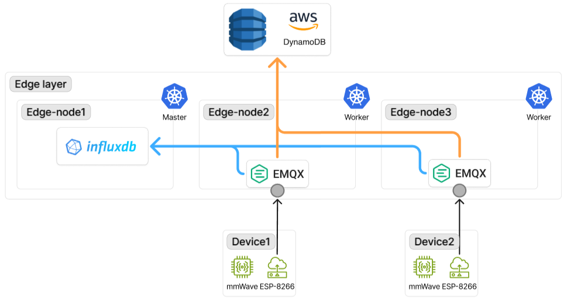

# storage

- 작성일: 2026-05-06
- 상태: 진행 중

## 다이어그램

## 결정 사항

### 1. 시계열 DB로 InfluxDB 채택 (2026-05-06)

- **선택**: InfluxDB 3.x를 raw timeseries 저장소로 사용. 변경 이벤트는 DynamoDB로 역할 분리
- **대안**: DynamoDB 단독 사용 (모든 데이터를 한 곳에), TimescaleDB, Prometheus(장기 저장 목적)
- **이유**: 시간대별·요일별 공간 사용 패턴 통계 기능(추후 확장 가능성)을 위해 raw timeseries 보존 필요. DynamoDB는 시계열 쿼리(group by time, last() 등) 부적합. InfluxDB는 measurement + tags + fields + timestamp 모델로 group by/aggregate가 효율적. 5초 polling × 9대 규모에 InfluxDB가 가장 자연스러움
- **트레이드오프**: 두 저장소 운영 필요 (InfluxDB + DynamoDB). 단 역할 명확히 분리되어 동기화 이슈 없음 (Edge Gateway가 두 곳에 각각 write)

### 2. InfluxDB를 e-s1 K3s Pod + 외장 SSD로 운영 (2026-05-06)

- **선택**: K3s Pod로 운영, nodeSelector로 e-s1 고정. 데이터는 e-s1의 외장 SSD에 저장. etcd와 같은 외장 SSD를 공유하되 디렉토리만 bind로 분리 (`/mnt/ssd/etcd`, `/mnt/ssd/influxdb`)
- **대안**: e-s3에 systemd 서비스 + microSD 저장 (이전 방식), 별도 외장 SSD 추가하여 etcd와 물리적 분리
- **이유**: K3s Pod로 운영하면 GitOps와 일관성 유지 (Helm chart로 매니페스트 관리). microSD 시절은 sustained random write IOPS가 매우 낮아 InfluxDB write시 iowait지연 문제.
- **트레이드오프**: e-s1 자원 부담 증가 (Argo CD + step-ca + cert-manager + InfluxDB + etcd 모두 e-s1). 외장 SSD 단일 장애 시 etcd와 InfluxDB가 동시 영향. Non-HA, e-s1 장애 시 InfluxDB write 중단되나 DynamoDB 경로는 유지되어 사용자 제공 서비스 영향은 없음.
- **변경 이력**: e-s3 systemd + microSD → e-s1 K3s Pod + 외장 SSD. etcd fsync cascading failure 트러블슈팅에서 microSD I/O가 클러스터 안정성에 미치는 영향이 노출되며 변경.
관련: [troubleshooting/260420_etcd-fsync-cascading-failure](../troubleshooting/260420_etcd-fsync-cascading-failure/)

### 3. Retention 무제한 (2026-05-06)

- **선택**: InfluxDB retention policy 무제한 (시간 기반 자동 삭제 없음)
- **대안**: 30일 / 90일 / 1년 retention
- **이유**: 시간대별·요일별 공간 사용 패턴 통계가 서비스 부가 기능이라 장기 데이터가 가치 있음. 5초 polling × 9대 × 24시간 × 365일 ≈ 약 5천만 row/년. 메시지당 약 200바이트로 계산해도 연 10GB 이내. 외장 SSD 용량 대비 부담 작음
- **트레이드오프**: 디스크 사용량 무한 증가. 1년 운영 후 실제 사용량 확인하여 retention 정책 도입 여부 재검토 필요

### 4. 데이터 모델: room_id 중심 tags + device_id는 field (2026-05-06)

- **선택**: measurement=`occupancy`, tags=`room_id`, `bssid`, fields=`occupied`, `rssi`, `device_id`
- **대안**: device_id + room_id 둘 다 tag, device_id만 tag (room_id는 외부 lookup)
- **이유**: device_id ↔ room_id가 1:1 매핑 (방 9개, 디바이스 9개)이라 둘 다 tag로 두면 정보 중복. 서비스 본질이 "방의 재실 여부"라 room_id 중심 쿼리가 자연스러움. device_id를 field로 두면 디바이스 교체 시 room_id 시계열이 끊기지 않고 연속 유지됨 (어떤 디바이스가 그 시점 보고했는지는 부가 정보로 보존). BSSID는 시간에 따라 변할 수 있고 AP 영역 장애 식별(공통점 분석)에 group by 필요해 tag 유지
- **트레이드오프**: device_id 단위 group by 쿼리는 비효율적 (필요시 InfluxDB 외부에서 후처리). 본 use case에서는 그런 쿼리 자체가 거의 없음

### 5. 디바이스 상태 추적은 InfluxDB + Prometheus 조합 (2026-05-06)

- **선택**: 디바이스 alive 여부는 InfluxDB `last(_time)` 쿼리 + Prometheus alert 룰로 처리.
- **대안**: ESP32Device CRD + Operator 도입
- **이유**: 디바이스 상태는 메시지 수신 여부로 충분히 판단 가능. InfluxDB에 이미 모든 메시지가 들어가므로 last(_time)으로 alive 판정 자연스러움. runtime에서 변경되어야 하는 변수가 거의 없기에, CRD생성은 over engineering으로 판단.
- **트레이드오프**: 디바이스 메타데이터(상태, 설정)를 K8s 오브젝트로 선언적 관리하지 않음.
- **변경 이력**: 초기 설계의 ESP32Device CRD + Operator 제거. CRD가 추가하는 가치(GitOps 일관성, 메타데이터 관리)가 ConfigMap + InfluxDB + Prometheus 조합으로 충분히 달성됨이 검토되어 도입 보류