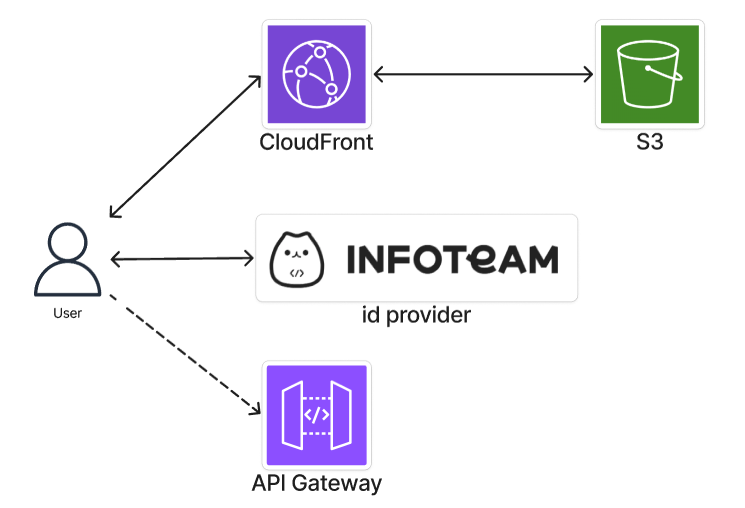

# frontend

- 작성일: 2026-06-15
- 상태: 작업 완료

웹서비스 실시간 재실 현황 SPA. React 19 + TypeScript + Vite + Tailwind CSS 4.
GIST 생활관 공용공간(라운지·휴게실·회의실)의 점유 여부를 실시간으로 표시.
백엔드(WebSocket/인증)는 별도 문서 [backend.md](backend.md).

## 다이어그램

## 구성

| 영역 | 소스 | 역할 |
|---|---|---|
| 진입/셸 | `src/App.tsx` | 인증 부트스트랩 + WebSocket 수명주기 + 헤더/범례/다크모드. 단일 hub |
| 데스크탑 뷰 | `src/components/IntegratedBuilding.tsx` | ≥768px. 평면 SVG 맵에 방별 fill 주입 |
| 모바일 뷰 | `src/components/IsometricBuilding.tsx` | <768px. 층 분리 + 가로 스와이프 snap, 동별 정렬 |
| 랜딩 | `src/components/LoginPage.tsx` | 로그인 전 목업 점유 프리뷰("보게 될 화면") |
| 인증 | `src/services/auth.ts` | gistory OIDC PKCE public client 래퍼 |
| WS 엔드포인트 | `src/services/api.ts` | `VITE_WS_URL` 주입, 로컬 fallback |
| 방 카탈로그 | `src/data/roomCatalog.ts` | 방 메타(이름/층/동) 정적 목록, `isOccupied: null` 시드 |
| 상태색 | `src/theme.ts` | 점유 상태 → fill 색 단일 진실원천 (라이트/다크 블렌드) |
| 보조 | `src/components/{Backdrop,ThemeIcon}.tsx` | 배경 그리드·글로우 / 인라인 sun-moon 아이콘 |

환경변수 (CI `frontend.yml` 가 환경별 주입, 로컬은 `.env`):
- `VITE_WS_URL` — API Gateway WebSocket 엔드포인트
- `VITE_CLIENT_ID` — gistory IdP PKCE client id
- `VITE_REDIRECT_URI` — OIDC redirect_uri (앱 루트)

## 데이터 흐름

1. 부트스트랩: URL 에 `code` 있으면 PKCE 콜백 교환, 아니면 localStorage User 복원
   (만료 시 silent renew). 실패 → LoginPage.
2. 인증 후 `${VITE_WS_URL}?token=<access_token>` 으로 WebSocket 연결, `getState` 로 초기 상태 pull.
3. 백엔드 `type:state` 메시지 수신 → `roomCatalog` 메타에 occupancy 주입(전체 교체) → 맵 fill 갱신.
   이후 변경분은 server-push (backend.md 결정 4).

## 결정 사항

### 1. 프레임워크: Vite + React SPA, 라우터·상태관리 라이브러리 없음 (2026-06-15)

- **선택**: Vite + React 19 단일 페이지. 화면 전환은 `App` 내 조건부 렌더(authReady → user →
  뷰)로 처리, 라우터·전역 상태 라이브러리 미도입. 서버 상태는 WebSocket 단일 소스
- **대안**: Next.js(SSR/라우팅), React Router + Redux/Zustand
- **이유**: 화면이 사실상 1개(맵) + 로그인 게이트뿐. 라우팅 표면이 없어 라우터 불필요.
  상태도 "방 목록 + 인증 User" 둘뿐이라 `useState`/`useRef` 로 충분 — 라이브러리는 과설계.
  정적 호스팅(S3/CloudFront)에 그대로 올라가 SSR 인프라 비용 0
- **트레이드오프**: 화면·상태가 늘면 App.tsx 비대(현 ~300L). 그 시점에 라우터·상태 분리 재검토

### 2. 반응형: 뷰포트 경계로 두 빌딩 컴포넌트 교체 마운트 (2026-06-15)

- **선택**: `md`(768px) `matchMedia` 로 데스크탑은 `IntegratedBuilding`(평면), 모바일은
  `IsometricBuilding`(층 분리 스와이프) 중 **하나만** 마운트. CSS `display` 토글 대신 조건부 렌더
- **대안**: 한 컴포넌트 + CSS 미디어쿼리(`hidden`/`md:block`)로 둘 다 마운트 후 숨김
- **이유**: 두 뷰의 SVG 변형 로직(viewBox·층 translate)이 크게 달라 한 컴포넌트로 묶으면 분기 복잡.
  또한 숨긴 SVG 에 fill 을 칠하면 Chrome 이 repaint 를 누락해 복귀 시 stale raster 잔존 →
  보이는 컴포넌트만 마운트해 회피
- **트레이드오프**: 경계 넘을 때 재마운트 비용(WS 는 App 보유라 끊기지 않음). 두 뷰의 fill 주입
  로직 일부 중복 → 공유 hook 추출 여지

### 3. SVG 맵: raw import 후 런타임 DOM 조작으로 fill 주입 (2026-06-15)

- **선택**: 단일 평면도 `gikview-structure.svg` 를 `?raw` 로 임포트, 방 `id`(`room-a-1-lounge`) 매칭해
  JS 로 `fill` 직접 설정. `theme.ts` 가 점유 상태 → 색 변환 단일 소스. 데스크탑은 viewBox 만 재설정,
  모바일은 층번호 파싱해 translate 를 문자열에 baking 후 직렬화
- **대안**: 방마다 React SVG 컴포넌트화, CSS class 토글, 이미지 스프라이트
- **이유**: 디자인 SVG 를 그대로 재사용 — 방 컴포넌트를 손으로 재작성하지 않음. 점유 상태가 잦게
  바뀌므로 React 재조정 대신 직접 DOM fill 이 가벼움. 색 정의를 `theme.ts` 한 곳에 모아 범례와 공유
- **트레이드오프**: `dangerouslySetInnerHTML` + 직접 DOM 접근이라 SVG `id` 규약과 강결합 —
  디자인 파일이 바뀌면 매칭 깨질 수 있음. paint 타이밍(useLayoutEffect)·탭 복귀 repaint 를
  수동 처리해야 함

### 4. 인증: oidc-client-ts PKCE public client, refresh_token localStorage 보관 (2026-06-15)

- **선택**: client_secret 없는 PKCE public client 로 프론트가 전체 흐름 처리. scope
  `email name student_id offline_access`(openid 미요청 → id_token 안받음). User(access+refresh_token)
  localStorage 보관 + `automaticSilentRenew`. WebSocket 재연결 직전 토큰 최신화
- **대안**: BFF/세션 쿠키, in-memory 토큰(새로고침 시 재로그인), Cognito Hosted UI
- **이유**: 정적 호스팅이라 서버 세션 없음 — 브라우저가 토큰 관리. localStorage 보관으로 새로고침 후
  세션 생존(UX 우선). `openid` 미요청으로 PII 토큰(id_token)을 브라우저에 안 둠 — backend authorizer 가
  access_token 으로 userinfo 검증만 하므로 충분
- **트레이드오프**: refresh_token 의 XSS 노출 위험을 감수 — 이 client 의 scope(WS 점유율 조회 +
  userinfo)가 곧 블래스트 반경이라 작음. 토큰을 WS 쿼리스트링으로 전달(backend.md 결정 5)해
  URL/로그 노출 → 짧은 만료로 완화

### 5. 연결 복원력: heartbeat + 지수 백오프 재연결 (2026-06-15)

- **선택**: 8분 주기 `ping`(API Gateway idle 10분 미만), 끊기면 지수 백오프 재연결(최대 30s),
  재연결 전 토큰 silent renew. 갱신 실패 시 `setUser(null)` 로 LoginPage 폴백 — 만료 토큰 무한
  재연결 차단
- **대안**: 고정 간격 재연결, 재연결 없음(수동 새로고침), SSE
- **이유**: server-push 특성상 연결 유지가 곧 신선도. idle timeout·일시 네트워크 단절을 자동 복구해
  사용자 개입 0. 백오프로 서버·IdP 폭주 방지
- **트레이드오프**: StrictMode 이중 마운트·언마운트 레이스를 ref 가드로 수동 처리. 토큰 만료가
  근본 원인이면 백오프 무의미 → 갱신 실패 즉시 로그인 폴백으로 분리

### 6. 의존성 최소화: 아이콘 인라인, 무거운 UI 라이브러리 회피 (2026-06-15)

- **선택**: Tailwind 4(`@tailwindcss/vite`) 유틸 + 인라인 SVG 아이콘(lucide path 복사). 런타임
  의존성은 `react`/`react-dom`/`oidc-client-ts` 셋뿐
- **대안**: lucide-react 배럴, 컴포넌트 UI 키트(MUI 등), CSS-in-JS 런타임
- **이유**: 아이콘 한두 개 위해 lucide-react 배럴(1500+ 모듈) 끌어오면 번들러 부하. Tailwind 유틸로
  스타일 충분 — 별도 디자인 시스템 불필요
- **트레이드오프**: 아이콘이 늘면 인라인이 번잡 → 시점에 트리셰이킹 가능한 개별 import 재검토
