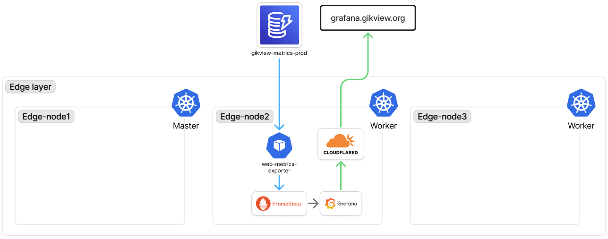

# visibility

- 작성일: 2026-06-16
- 상태: 작업 완료

웹서비스(API Gateway WebSocket + Lambda + DynamoDB)의 **사용자 수요(demand) 가시화**. 실사용 규모·피크 시간대·공지/광고 효과를 본다. edge visibility 가 장애 진단용인 것과 목적이 다르다(결정 1). 메트릭은 edge 의 기존 Grafana(`grafana.<domain>`)에 합류.

backend 구성은 [backend.md](backend.md), IAM Roles Anywhere 는 [edge/security.md](../edge/security.md) 및 `context/knowledge/iam-roles-anywhere.md`.

## 다이어그램

## 결정 사항

### 1. 목적은 ops 가 아니라 demand 가시화 (2026-06-16)

- **선택**: 동접·유입률로 실사용 규모/피크를 본다. Lambda 성능·에러·동시성(ops)은 범위 밖
- **대안**: edge 처럼 장애 진단용 ops 대시보드
- **이유**: web 은 AWS 관리형 서버리스라 가용성은 AWS 보장 — 진단 대시보드 가치 낮음. 유일 운영 리스크 throttle 은 무료 알람으로 충분(결정 6). "몇 명이 언제 쓰는가"는 edge 에 없는 web 고유 신호
- **관련**: 결정 6번

### 2. CloudWatch pull(yace) 대신 DynamoDB 상태평면 재사용 (2026-06-16)

- **선택**: CloudWatch 에서 당기지 않고, AWS↔edge 공유저장소 DynamoDB 를 메트릭 소스로 read
- **대안**: yace 로 `GetMetricData` 폴링, Metric Streams→Firehose, custom metric(EMF)
- **이유**: `GetMetricData` 는 무료티어 **제외**라 폴링이 영구 과금(월 ~$3.5). DynamoDB read 는 25 RCU 무료티어 내 + edge-gateway 가 이미 DynamoDB write 경로 보유. 대안들도 Firehose/$0.30·metric 으로 무료 아님
- **트레이드오프**: AWS native(cold start/p99/throttle) 못 얻음 — demand 목적엔 무관, 결정 6 으로 보완
- **관련**: 결정 1·6번

### 3. demand 지표는 `web_connect_total` 하나로 (2026-06-16)

- **선택**: `$connect` 를 단조증가 counter 로 누적, `rate()` 로 유입률·피크. 동접 gauge·세션 길이·방별 인기·broadcast·duration·cold start 미채택
- **대안**: 동접 gauge(Scan COUNT), 세션 길이 히스토그램, broadcast outbound 카운터
- **이유**: 핵심 기능이 "방 상태 3초 확인 후 이탈"이라 세션 <30s. 단명 세션에선 동접 gauge 가 점샘플 노이즈 + Little's law 상 값 자체가 작아 규모를 못 나타냄. 누적 counter 유입률은 샘플링 무관하게 전부 포착. broadcast=`센서변화×동접`은 센서분이 pipeline 대시보드와 중복, 방별 인기는 getState 가 전체맵 반환이라 귀속 불가
- **트레이드오프**: 유입 *이벤트율*이지 순방문자 아님(새로고침·재연결도 +1). distinct 는 counter 불가
- **관련**: 결정 1번

### 4. 수집: Lambda 메모리 누적 + 주기 flush → DynamoDB counter (2026-06-16)

- **선택**: handler 가 `$connect` 를 메모리 +1 누적, "마지막 flush 후 30s 또는 50건"이면 `UpdateItem ADD` 로 1회 flush 후 0 리셋
- **대안**: `$connect` 마다 동기 write, EMF/`PutMetricData`, Pushgateway/remote_write
- **이유**: 매 connect 동기 write 는 연결 크리티컬 패스에 DynamoDB 왕복(~5–10ms). 메모리 누적이면 호출당 비용 0, write 는 30s 당 1회. 동시성 컨테이너도 각자 delta 를 `ADD` 원자 누적해 총합 정확. Pushgateway/remote_write 는 ephemeral 이라 counter 의미 깨짐
- **트레이드오프**: flush 전 컨테이너 kill 시 미flush 몇 건 유실 — 추세 지표라 허용
- **관련**: 결정 3번

### 5. exporter: Roles Anywhere read role + signing helper 내장 커스텀 이미지 (2026-06-16)

- **선택**: edge monitoring NS 의 Go exporter 가 `CN=web-visibility` cert 로 read role assume → 카운터 read → `/metrics`. `aws_signing_helper` 이미지 내장(`credential_process`). DynamoDB 폴링 60s 캐시 → Prometheus 가 캐시 스크랩
- **대안**: 기성 이미지 + signing helper sidecar(`serve`), 스크랩마다 DynamoDB 직접 read
- **이유**: exporter 가 자체 코드라 edge-gateway 처럼 helper 내장이 최단(sidecar 는 못 고치는 기성 이미지 우회책). Trust Anchor(step-ca Intermediate) 재사용, read role + CN 만 신규로 write role 과 분리. 폴링을 60s 로 묶어 스크랩 빈도와 RCU(비용) 분리, counter 가 DynamoDB 영속이라 재시작에도 안 깨짐
- **트레이드오프**: signing helper arm64 크로스빌드 필수(amd64 면 exec format error)
- **관련**: 결정 2번, edge/pipeline.md(edge-gateway)

### 6. ops 지표(throttle/concurrency/errors)는 CloudWatch 무료 알람으로 (2026-06-16)

- **선택**: 런타임 밖이라 자가계측 불가한 Lambda `Throttles`·`ConcurrentExecutions`·`Errors` 에 CloudWatch 알람(무료 10개) → SNS → email(또는 변환 Lambda 경유 Discord — SNS 가 Discord webhook 포맷 직접 못 보냄). 대시보드 미생성
- **대안**: 자가계측 후 yace export 로 Grafana 패널
- **이유**: throttle 은 실행 자체가 안 돼 코드 내부 카운트 불가, error 도 try/except 는 런타임 크래시/타임아웃/OOM 못 잡음 — CloudWatch native 만 앎. 알람은 `GetMetricData` 과금 없이 평가 → 무료. "터지면 알림"이면 충분
- **관련**: 결정 1번
