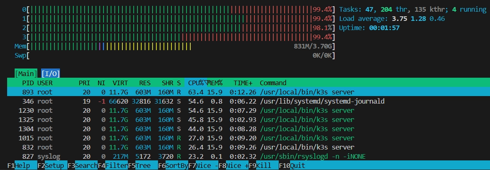

# EMQX 배포 중 엣지 클러스터 cascading failure와 SSH 단절

> 이 디렉토리의 문서, 시각화 자료는 Claude(Anthropic)를 활용해 작성됨.

- 발생: 2026-04-20
- 상태: 원인 확정
- 최종 상태: [result.md](result.md)

## 증상

Argo CD로 EMQX StatefulSet을 엣지 클러스터에 배포하던 중 e-s1의 SSH가 끊기고 `kubectl` 명령이 무응답 상태가 됨. 이후 e-s2, e-s3로 장애가 전파되며 etcd가 quorum을 잃고 raft pre-vote가 무한 재시도에 진입.

저장매체 개선안을 탐색하는 과정에서 emqx-lb Helm 재배포 중 e-s1 SSH가 다시 끊기는 현상이 재발.

**환경**
- RPi4 4GB × 3 (e-s1/e-s2/e-s3, 3노드 모두 K3s Server + etcd HA)
- Ubuntu Server 24.04 arm64, K3s v1.34.6
- Cilium 1.19.2 (kubeProxyReplacement=true, L2 Announcements 활성)
- rootfs: microSD

## 접근

### Approach 1 — 장애 직후 3가지 원인 후보 격리 검증

- 동기: 장애 로그에서 etcd quorum 손실 + raft pre-vote 재시도가 관측됨. 트리거가 될 수 있는 상시 동작 컴포넌트 중 CPU/IO 부하 후보 3가지를 가설로 세우고 격리 측정.
- 가설:
  - H1 microSD의 sync write 성능이 낮아 etcd fsync가 병목: **채택**
  - H2 Service 이벤트 발생 시 Cilium agent의 eBPF 리로드가 CPU 포화 유발: **기각**
  - H3 Argo CD 컨트롤러의 상시 Git polling + reconcile이 유의미한 CPU 점유: **기각**
- 종합 결론: microSD I/O 병목이 지배적 원인으로 추정. Cilium과 Argo CD는 평시 조건에서 유의미한 기여 없음.
- 상세: [approach-01.md](approach-01.md)

### Approach 2 — emqx-lb 재배포 중 SSH 단절 재발, Approach 1에서 기각한 Cilium 재검증

- 동기: 저장매체 개선안 탐색 중 emqx-lb Helm 재배포(이미지 풀링 미동반)에서 동일 증상 재발함. 이는 approach 1에서 확정한 i/o병목이 아니라고 추정.
- 가설:
  - H1 실 운영 워크로드 배포 시 Cilium agent CPU가 유의미하게 스파이크: **채택**
- 종합 결론: Cilium eBPF 리로드 부하가 평시 대비 약 2배 상승함이 재현되었으나 절대 수치(노드 총량 대비 4.4%)가 SSH 단절을 단독으로 설명하기엔 부족. 실제 장애는 저장매체 병목과 Cilium 부하가 겹친 복합 조건일 가능성.
- 상세: [approach-02.md](approach-02.md)

## 해결

저장매체와 네트워크 두 축으로 해결시도. 저장매체는 etcd 및 I/O 집약 서비스를 외장 SSD배치 node로 이동, Cilium 리소스 limit과 L2 Announcement → NodePort 전환.
구조적으로는 3노드 HA(server × 3)를 단일 control plane + 2 worker 구성으로 전환해 etcd quorum 경쟁 자체를 제거하는 방향으로 정리.

상세 수치: [result.md](result.md)