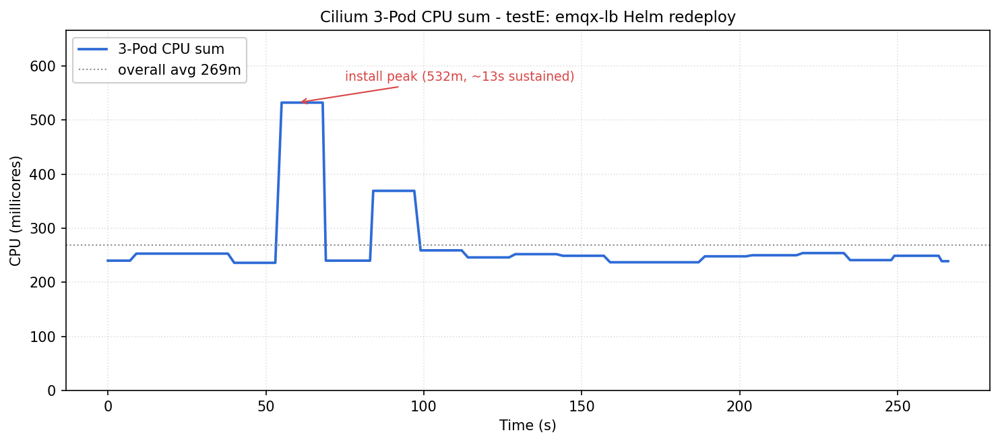

# Approach 2 — emqx-lb 재배포 중 SSH 단절 재발, Cilium을 실 워크로드 조건으로 재검증

## 동기

Approach 1 이후 emqx 정상 동작 테스트를 위해 배포를 이어가던 중 emqx-lb Helm 재배포 과정에서 동일한 SSH 단절 현상이 재발. 이번 재배포는 **이미지 풀링이 동반되지 않는 매니페스트 단순 갱신**이었으므로 Approach 1 시나리오(이미지 풀링 + Pod 대량 생성)와 부하 성격이 다름. 이에 따라 Approach 1에서 기각한 Cilium 가설(H2)을 실 운영 워크로드 조건에서 재검증.

**배경 관찰**
- emqx-lb는 LoadBalancer Service + CiliumLoadBalancerIPPool + CiliumL2AnnouncementPolicy + 실제 selector 매칭되는 EMQX Pod 3개를 포함한 복합 구성
- 재배포 과정에서 Service/endpoint 갱신 + L2 Announcement lease 재등록 + eBPF map 재작성이 동시에 발생
- Approach 1의 H2 테스트(빈 Service churn)는 이 조건을 재현하지 못함

**공통 환경**
- K3s v1.34.6 HA (server × 3, 임베디드 etcd)
- Cilium 1.19.2 (kubeProxyReplacement=true, L2 Announcements)
- emqx-lb: LoadBalancer Service + IPPool + L2AnnouncementPolicy, EMQX StatefulSet 3 replica가 이미 배포되어 endpoint 매칭 상태
- 측정 스크립트: `helm uninstall emqx-lb` → 30초 대기 → `helm install emqx-lb` 순서로 재배포. Cilium 3 Pod의 CPU를 1초 간격으로 수집

## 가설별 검증

### H1. 실 운영 워크로드 재배포 시 Cilium agent CPU가 유의미하게 증가

- **근거**: Approach 1의 H2 기각은 "endpoint가 매칭되지 않는 빈 Service"라는 제한된 조건에서만 유효. 실제 emqx-lb 재배포는 endpoint 재계산 + L2 Announcement lease 재등록 + IPPool 할당 등 eBPF map에 실질적 변경을 유발하므로 Cilium CPU 상승 가능성.
- **테스트 방식**:
  - `helm uninstall emqx-lb` 실행 → 30초 대기 → `helm install emqx-lb` 실행 (이벤트 타임스탬프는 `raw/cilium_load2_emqx-lb/testE_events_143617.log`)
  - 측정 180초 동안 `kubectl top pod -l k8s-app=cilium`을 1초 간격으로 폴링하여 3 Pod CPU 합계 시계열 수집
  - 본 가설은 **Cilium Pod의 CPU 부하**에만 초점. 노드 전체 CPU/iowait 및 EMQX Pod 자체의 부하는 별도 관찰 대상으로 이월
- **결과**:

  

  baseline 구간에서 3 Pod CPU 합계가 약 240m로 유지되다가, `install_done` 직후 약 10초 뒤부터 **532m**까지 상승해 약 13초간 유지. 이후 잠시 회복했다가 370m 수준의 2차 피크가 한 번 더 발생. 평시 대비 약 2배 상승이 관측되어 Approach 1의 빈 Service churn 결과(baseline 대비 변화 없음)와 대비.

- **Raw 데이터**:
  - [`cilium_load2_emqx-lb/testE_cilium_143617.log`](raw/cilium_load2_emqx-lb/testE_cilium_143617.log)
  - [`cilium_load2_emqx-lb/testE_events_143617.log`](raw/cilium_load2_emqx-lb/testE_events_143617.log)
- **결론**: **부분 채택**. 실 운영 워크로드 재배포 시 Cilium CPU는 평시 대비 약 2배 상승이 재현됨. 다만 본 측정 중에는 **SSH 단절이 재현되지 않았고**, 피크 절대값도 3노드 총 12000m 대비 532m(약 4.4%)로 그 자체로 cascading failure를 유발할 수준은 아님. 따라서 "Cilium이 Service 이벤트에 유의미한 CPU를 소비한다"는 점은 입증되었으나, **앞선 SSH 단절의 직접 원인으로 단정하기에는 근거 부족**. 재현 실패 원인으로는 (a) 측정 시점이 실제 장애 시점과 다른 클러스터 상태, (b) Cilium 외의 동시 부하(예: 잔여 finalizer 처리, 기존 IPPool 자원 정리) 부재, (c) 복합 조건 누락 등이 가능.

## 종합 결론

Approach 1의 H2 기각이 "빈 Service churn" 조건에만 유효했음을 실 워크로드 측정으로 확인. Cilium eBPF 리로드 부하는 분명히 존재하지만 절대 수치가 SSH 단절을 단독으로 설명할 수준은 아님. 실제 장애의 방아쇠는 **저장매체 병목(approach-01 H1 확정)과 Cilium 부하가 겹치는 복합 상황** 또는 **본 측정에서 재현되지 않은 추가 조건**일 가능성이 남음.

**다음 행동**
- 완화 전략을 두 축 모두에 적용: 저장매체 개선 + Cilium 리소스 limit / L2 Announcement lease 주기 튜닝
- 저장매체 교체 후 동일한 emqx-lb 재배포 시나리오 재측정으로 개선 효과 확인