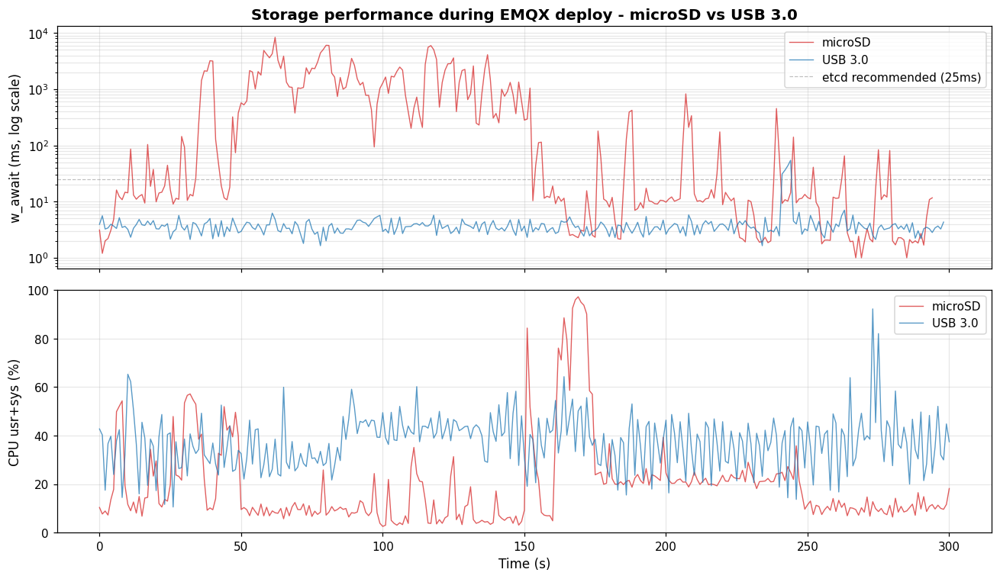

# 최종 상태

## 근본 원인

K3s 임베디드 etcd의 fsync write가 microSD의 4K sync write 처리량 한계(약 67 IOPS, testA `fio` 측정 기준)를 초과하여 write latency가 폭증. EMQX 배포와 같은 write burst 상황에서 raft election timeout(기본 1000ms)을 수 배 상회하는 지연이 발생하며 etcd quorum이 흔들렸고, 이어 apiserver 응답 불가 및 노드 간 cascading failure로 이어짐. 저장매체의 구조적 한계가 지배적 원인으로 작용함.

확정 경로: [approach-01.md](approach-01.md)

## 해결 조치

- e-s1의 etcd 데이터 경로(`/var/lib/rancher`)를 microSD에서 USB 3.0 외장 저장매체로 임시 이전 (외장 SSD 전환 예정)
- K3s HA(server × 3) 구조를 단일 control-plane(e-s1) + 2 agent(e-s2, e-s3) 구조로 전환하여 etcd fsync 복제 부담 제거
- EMQX 워크로드를 worker 노드(e-s2, e-s3)에만 배치하여 control-plane 자원 분리
- Cilium L2 Announcement를 NodePort 직접 노출로 전환하여 단일 control-plane 토폴로지에서의 SPOF 회피

## 핵심 수치

| 지표 | Before (microSD) | After (USB 3.0) | 측정 방법 |
|---|---|---|---|
| w_await p95 | 3,608 ms | 5.6 ms | `iostat -x` 1초 간격, EMQX Helm install 300초 구간, etcd 데이터 경로 디스크 |
| w_await peak | 약 8,000 ms | 약 10 ms | 동일 구간, 동일 도구 |
| iowait avg | 20.2% | 2.7% | `mpstat -P ALL` 1초 간격, 동일 구간 |
| usr+sys avg | 약 18.2% | 약 37% | `mpstat -P ALL` 1초 간격, 동일 구간 |
| cascading failure 재현 | 발생 | 미발생 | EMQX 재배포 1 회 |

## 남은 과제

- approach-02의 emqx-lb 재배포 시나리오를 저장매체 교체 후 재측정하여 SSH 단절 재현 여부 확인 (Cilium 부하의 잔여 영향 평가)
- argocd-repo-server liveness probe timeout 튜닝(`timeoutSeconds: 10`, `failureThreshold: 5`) 적용 후 재시작 카운트 추이 확인
- USB 3.0 → 외장 SSD 전환 시 동일 지표 재측정 계획