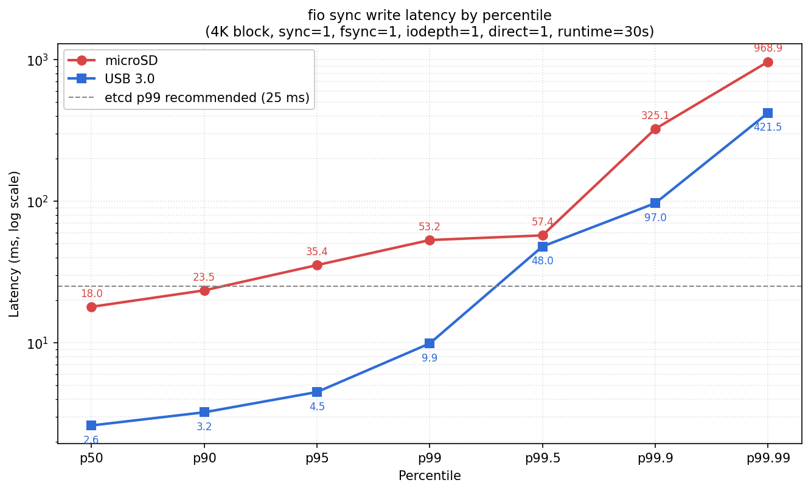
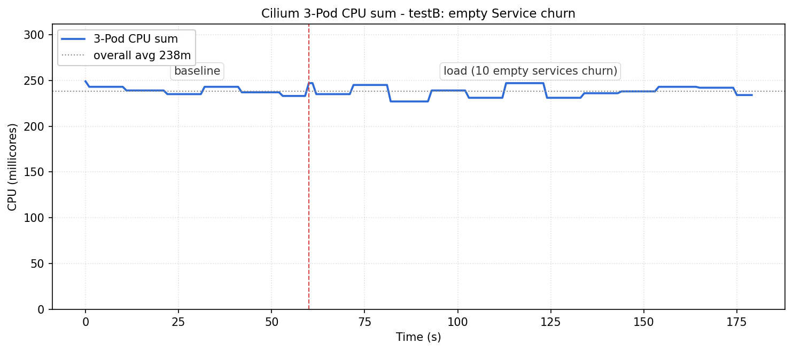
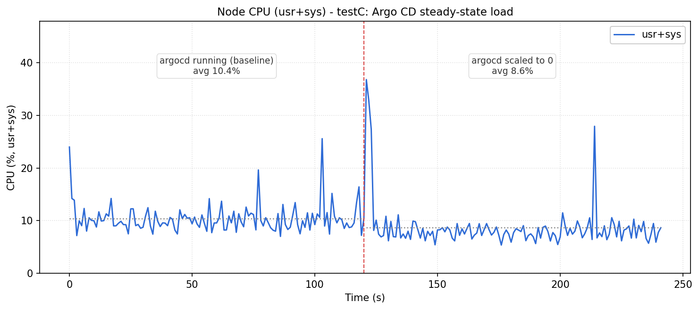

# Approach 1 — 장애 직후 3가지 원인 후보 격리 검증

## 동기

EMQX 배포 중 e-s1의 SSH가 끊기고 이후 e-s2, e-s3로 장애가 전파되는 cascading failure가 관측됨. 장애 구간의 시스템 로그와 클러스터 상태에서 etcd quorum 손실, raft pre-vote 무한 재시도, 노드 NotReady 전이가 확인됨. 트리거가 될 수 있는 상시 동작 컴포넌트 3가지를 가설로 세우고 격리 측정으로 각각의 기여도를 분리.

**배경 관찰**
- EMQX 배포는 이미지 풀링 + StatefulSet Pod 3개 생성 + Service/Endpoint 생성이 동시에 진행되는 복합 이벤트
- 동시에 Service 이벤트도 발생 → Cilium eBPF 업데이트도 가능성 있음
- Argo CD는 배포 주체로서 상시 동작 중

**공통 환경**
- K3s v1.34.6 HA (server × 3)
- 노드: RPi4 4GB × 3 (e-s1/e-s2/e-s3), Ubuntu Server 24.04 arm64, microSD
- Cilium 1.19.2 (kubeProxyReplacement=true, L2 Announcements)
- Argo CD default 구성 (ApplicationSet + ApplicationController + Redis 등 7 Pod)

## 가설별 검증

### H1. microSD의 sync write 성능이 낮아 etcd fsync를 포화시킴

- **근거**: etcd는 raft consensus 안전성을 위해 모든 write에 fsync 호출. microSD는 4KB 랜덤 sync write가 구조적으로 취약(erase block 재작성, DRAM 캐시 부재).
- **테스트 방식**:
  - `fio` 4K sync write 30초 (etcd WAL 패턴 모사): `--rw=write --bs=4k --sync=1 --fsync=1 --iodepth=1 --direct=1`
  - `etcdctl check perf` 60초
  - 비교 기준으로 USB 3.0 메모리에서도 동일 `fio` 측정
- **결과**:

  

  microSD는 p99 53ms로 etcd 권장 기준(25ms)을 초과하고, p99.9 325ms, max 966ms로 tail이 심각. `etcdctl check perf`는 slowest request 0.959s로 **FAIL**(기준 0.5s). USB 3.0은 동일 조건에서 p99 9.9ms로 기준 통과, IOPS 4.5배 차이. 즉 SD카드 자체가 etcd 요구 수준을 만족하지 않음.

- **Raw 데이터**:
  - [`testA_fio_microSD.json`](raw/microSD-io_load/testA_fio_microSD.json)
  - [`testA_fio_usb30.json`](raw/microSD-io_load/testA_fio_usb30.json)
  - [`testA_etcd_perf.log`](raw/microSD-io_load/testA_etcd_perf.log)
- **결론**: **채택**. microSD는 etcd 요구 기준을 평시에도 미달. 부하 순간에는 tail이 raft election timeout을 유발할 수준까지 악화.

### H2. Service 이벤트 시 Cilium eBPF 리로드가 CPU를 대량 소비

- **근거**: kubeProxyReplacement=true 구성에서 Service 생성/삭제 시 Cilium agent가 eBPF map을 재작성. L2 Announcements 활성 시 lease 처리도 동반. EMQX 배포는 Service + StatefulSet을 동시에 생성하므로 Cilium 부하 가능성.
- **테스트 방식**:
  - 빈 ClusterIP Service 10개를 30초 주기로 create/delete 반복 (2분)
  - baseline 60초 + load 120초로 Cilium 3 Pod의 CPU 추이(`kubectl top pod`) 관찰
- **결과**:

  

  baseline 평균 239m, load 평균 238m. 노이즈 범위 내 변동으로 유의미한 증가 없음. 개별 Pod 단위 차이도 ±1m 수준.

- **Raw 데이터**:
  - [`testB_baseline_cilium.log`](raw/cilium_load/testB_baseline_cilium.log)
  - [`testB_load_cilium.log`](raw/cilium_load/testB_load_cilium.log)
  - [`testB_baseline_025606_mpstat.log`](raw/cilium_load/testB_baseline_025606_mpstat.log)
  - [`testB_load_025835_mpstat.log`](raw/cilium_load/testB_load_025835_mpstat.log)
- **결론**: **기각**. clium이 야기하는 cpu부하는 예상보다 적은 것으로 판단.

### H3. Argo CD의 상시 Git polling + reconcile이 유의미한 CPU 점유

- **근거**: Argo CD는 ApplicationController/ApplicationSet/Repo-server 등 7개 Pod이 상시 동작. 기본 설정에서 3분 주기 Git polling + 주기적 reconcile로 etcd/CPU에 지속적 부하 가능성.
- **테스트 방식**:
  - argocd 네임스페이스를 운영 상태로 두고 노드 CPU(`mpstat all` usr+sys) 120초 측정
  - Deployment/StatefulSet replica를 0으로 scale 후 3분 30초 대기, 이후 동일 120초 재측정
  - argocd 7 Pod의 개별 CPU(`kubectl top pod`)도 참고로 수집
- **결과**:

  

  argocd 운영 시 usr+sys 평균 10.4%, scale=0 시 8.6%. 차이 **+1.7%p**로 노이즈 수준. argocd 7 Pod의 CPU 합계도 50m에 불과.

  부가 관찰: argocd 삭제 직후 측정 시작 시점에서 w_await 202ms, iowait 32%의 일시적 CPU부하가 관측됨. kubelet cleanup으로 인한 etcd 대량 write가 원인으로 추정되며, 이는 **H1(microSD I/O 병목)을 재확인**하는 간접 증거.

- **Raw 데이터**:
  - [`testC_argocd_on_030319_mpstat.log`](raw/argoCD_load/testC_argocd_on_030319_mpstat.log)
  - [`testC_argocd_off_030648_mpstat.log`](raw/argoCD_load/testC_argocd_off_030648_mpstat.log)
  - [`testC_argocd_on_030319_iostat.log`](raw/argoCD_load/testC_argocd_on_030319_iostat.log)
  - [`testC_argocd_off_030648_iostat.log`](raw/argoCD_load/testC_argocd_off_030648_iostat.log)
  - [`testC_argocd_on_pods.log`](raw/argoCD_load/testC_argocd_on_pods.log)
- **결론**: **기각**. 상시 부하 기여도 1.7%p로 cascading failure를 유발할 수 없음.

## 종합 결론

장애 당시 3 후보 중 **microSD I/O 병목(H1)이 cascading failure를 유발할 수 있는 수준의 결함**으로 확정.

**다음 행동**
- 저장매체 교체 옵션 탐색 (USB 3.0, SSD 검토)
- microSD I/O가 단일 원인인지, 복합 원인 중 지배적 요소인지 확인을 위해 통합 재현(EMQX 전체 배포) 측정 준비