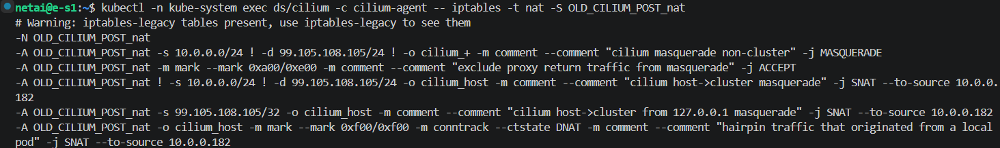
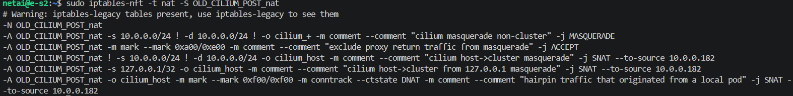

# Approach 1 — 손상된 NAT 룰 추적 및 코드 경로 분석

## 동기

ArgoCD가 Application refresh에 실패. argocd-repo-server에서 외부 git으로 나가는 트래픽이 끊긴 것으로 의심하고 클러스터 내부 DNS 동작부터 점검 → CoreDNS 자체가 외부 DNS 서버로 질의 못 하는 상태 확인 → CoreDNS Pod이 떠 있는 노드의 호스트 인터페이스 `tcpdump`에서 outbound 패킷이 Pod CIDR(10.0.x.x) 그대로 노출됨을 확인. 노드 IP로 SNAT되어야 하는데 동작하지 않음.

cilium-agent 로그에서 약 10초 주기로 반복되는 reconciliation 에러의 룰 인자에 `99.105.108.105`가 등장. 이 값을 단서로 NAT 룰 생성 경로를 역추적.

**배경 관찰**
- 손상은 cilium 재시작 직후부터 관찰됨. 이전 etcd 사건(`260420-etcd-fsync-cascading-failure`) 복구 과정에서 control-plane 강제 재시작과 worker의 cilium-agent kill이 동시에 진행된 시점과 일치
- `99.105.108.105` = `0x63 0x69 0x6c 0x69` = ASCII `cili`. `net.IP([]byte("cili")).String()`이 정확히 이 값을 만들어냄
- 동일 패턴이 cilium issue #33465에 보고되어 있음

**공통 환경**
- Cilium 1.19.2 (Helm), 컨테이너 번들 iptables 1.8.8
- 호스트 iptables 1.8.10 (컨테이너와 nft 표현식 직렬화 포맷이 다른 버전)
- routing tunnel(vxlan), bpf-masquerade=false (iptables 모드)
- `ipv4NativeRoutingCIDR`: 미설정
- K3s v1.34.6, 3 노드, RPi4 arm64

## 가설별 검증

### H1. 컨테이너 번들 iptables와 호스트 iptables 사이 nft 표현식 직렬화 비호환으로 `iptables -S` 출력에서 comment 바이트가 IP 슬롯으로 leak되고, cilium-agent가 그 손상된 텍스트를 그대로 `-D`로 재전송한다

- **근거**:
  - Cilium 컨테이너는 `quay.io/cilium/iptables:1.8.8`을 강제 설치(`images/runtime/Dockerfile`)하여 호스트 OS의 iptables 버전과 분리시킴. 그러나 iptables-nft 모드에서는 호스트 커널의 nftables 백엔드를 공유하므로 분리가 완전하지 않음
  - `pkg/datapath/iptables/iptables.go`의 `removeCiliumRules`는 `iptables -t <table> -S` 출력을 받아 각 라인을 `-A`→`-D`로 치환해 그대로 재실행. 커널은 본문 byte-exact 일치를 요구하므로, 출력 텍스트가 한 바이트라도 어긋나면 삭제 거부
  - cluster-pool + helm `ipv4NativeRoutingCIDR=""` 조합에서 Go 측 CIDR 배관(`option.Config.IPv4NativeRoutingCIDR`, `LocalNode.Local.IPv4NativeRoutingCIDR`)은 `nil`로만 흐름. Go 코드가 `cili` 4 byte를 만들어낼 경로가 정적 분석 상 부재
  - `net.IP([]byte("cili")).String() == "99.105.108.105"`. 즉, 어딘가 `[]byte` 버퍼(comment 문자열 등)가 `net.IP`처럼 4 byte로 해석되었을 때 정확히 이 값이 나옴
- **테스트 방식**:
  - cilium 컨테이너 내부와 호스트 양쪽에서 `iptables -t nat -S OLD_CILIUM_POST_nat` 직접 비교 (동일 노드, 동일 시점, 동일 nft 백엔드)
  - cilium 코드 경로 정적 분석으로 Go 측 CIDR 손상 가능 경로 부재 확인
  - cilium issue #33465 thread에서 다른 보고자(liyihuang)의 1.8.8 vs 1.8.10 nft 표현식 정렬 비교 데이터 교차 확인
- **결과**:
  - cilium 컨테이너 내부 dump:

    
  - 호스트 dump:

    
  - 결정적 단서: 손상된 룰의 `comment` 문자열은 `cilium-feeder`/`cilium masquerade non-cluster` 등으로 정상 보존된 채 IP 컬럼만 가비지로 변형. 이는 in-memory 상태 손상이 아니라 **iptables 텍스트 출력 시점의 필드 misalignment** 패턴 — comment 영역 자체는 정상이지만, 다른 버전이 쓴 nft 표현식을 읽는 binary가 필드 경계를 잘못 잡아 그 첫 바이트들이 IP 슬롯에 함께 표시됨
  - liyihuang의 비교 데이터에서 동일한 룰 셋이 1.8.10이 쓰면 `ip saddr ... ip daddr ... oifname ...` 순서로, 1.8.8이 쓰면 `oifname ... ip saddr ... ip daddr ...` 순서로 nftables에 저장됨이 확인됨. 한쪽이 쓴 표현식을 다른 쪽이 읽으면 필드 정렬이 어긋날 수 있는 구조
- **결론**: **채택**. nft 백엔드에 저장된 데이터 자체는 멀쩡하나, 컨테이너 번들 iptables가 다른 버전이 쓴 표현식을 텍스트 직렬화할 때 필드가 어긋나 손상된 텍스트가 출력됨. cilium-agent의 정리 경로는 그 텍스트를 검증 없이 그대로 `-D`로 재전송하므로 커널이 거부하고 reconcile은 무한 재시도. helm `ipv4NativeRoutingCIDR` 미설정은 트리거 조건이 아니며 별도 검증 가드로는 막을 수 없음(손상된 `99.105.108.105/24`도 syntactically valid한 CIDR이라 `net.ParseCIDR`을 통과).

## 종합 결론

손상은 `iptables -S` 텍스트 출력 시점에 발생하며, cilium-agent가 그 텍스트를 byte-exact replay하는 정리 경로를 통해 deadlock으로 발전. 손상의 발생 표면 자체(컨테이너↔호스트 iptables 버전 skew)와 그 텍스트를 신뢰하는 Go 측 정리 경로 양쪽이 결합되어 발현. Helm config 가드(`ipv4NativeRoutingCIDR` 검증 등)로는 차단 불가능하며, masquerade 경로 자체를 사용하는 한 손상이 발생할 가능성이 남음.

**다음 행동**
- iptables masquerade 경로 우회: `bpf.masquerade=true`로 전환하여 SNAT를 eBPF datapath에서 처리 (현장 즉시 조치)
- cilium-agent의 `removeCiliumRules`를 `iptables -S` 본문 의존에서 line number + target prefix 기반으로 재작성하는 PR 제출 (root cause fix). 기존 검증 가드 PR(cilium/cilium#45866)은 손상 CIDR이 syntactically valid해 가드로 못 잡으므로 close
