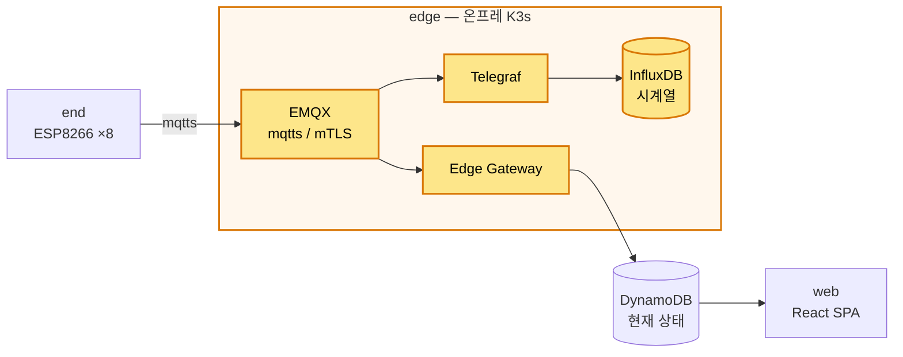

# edge

gikview 엣지 인프라. 온프레미스 RPi4 K3s 클러스터에서 센서 데이터 수집·적재·전달 + PKI + 관측을 GitOps(Helm + ArgoCD)로 운영한다.

## 시스템 내 위치



edge = 디바이스와 클라우드 사이. mqtts(mTLS) 수신, 디바이스 인증서 발급(step-ca), 시계열 적재(InfluxDB), 상태 변경만 DynamoDB upsert, 클러스터 관측(Prometheus/Grafana).

## 디렉토리 구조

```
edge/
├── helm/<service>/      서비스별 Helm chart (values.yaml + values-{dev,prod}.yaml)
├── docker/<service>/    자체 빌드 이미지 Dockerfile (edge-gateway, mapping-generator, step-ca, web-metrics-exporter)
├── argocd/              App-of-Apps + 서비스별 Application (prod GitOps). sync-wave 정본 = argocd/README.md
└── tests/<phase>/       서비스별 smoke 테스트
```

## 핵심 흐름

배포 단위 = **phase**. 4개 phase 가 순서대로 의존한다.

| phase | 서비스 | 역할 |
|---|---|---|
| security | step-ca, cert-manager, step-issuer, reloader, mapping-generator, emqx | mTLS PKI + ACL/화이트리스트. 디바이스/워크로드 인증서 발급 |
| storage | influxdb | 센서 시계열 적재 (외장 SSD) |
| pipeline | telegraf, edge-gateway | EMQX share group 분리 → raw=InfluxDB / 상태변경=DynamoDB |
| visibility | prometheus, alertmanager, grafana, node-exporter, telegraf-freshness, cloudflared | 파이프라인 전 구간 관측·알림 |

- **디바이스 인증** = mTLS. step-ca 가 Intermediate CA. ESP8266 은 공통 부트스트랩 인증서로 첫 부팅 → EST-like 흐름으로 정식 인증서 발급.
- **EMQX shared subscription** 을 share group 으로 분리 → Telegraf(raw→InfluxDB) + Edge Gateway(상태변경→DynamoDB) 가 독립 수신.
- **AWS 접근** = IAM Roles Anywhere. Edge Gateway 가 step-ca 인증서를 재사용해 임시 자격증명 발급(정적 키 없음).
- **관측** = Prometheus pull + Grafana(Cloudflare Tunnel 외부 노출) + Alertmanager(Discord + healthchecks.io watchdog).

## 사전 작업

운영자 1회, 환경별. 상세는 각 `context/phases/edge-*.md` 의 "선행 작업" 절.

| 분류 | 내용 |
|---|---|
| OS | 외장 SSD `/mnt/ssd` 마운트 + chown, badger hostPath chown, K3s `--etcd-expose-metrics` |
| 네트워크 | 공유기 포트포워딩 — EMQX / step-ca `:31900` (디바이스가 학내망에서 도달) |
| 레지스트리 | GHCR `ghcr-pull` Secret + `docker login`, multi-arch buildx 셋업 |
| AWS | IAM Roles Anywhere trust anchor 등록(step-ca Intermediate), DynamoDB `gikview-rooms` / `gikview-metrics-{env}` |
| Cloudflare | Tunnel 생성 + Access(GitHub IdP) 정책 + `cloudflared-token` |
| K8s Secret | `device-room-mapping`, `alertmanager-discord`, `alertmanager-healthchecks`, `grafana-admin`, `influxdb-admin-token` 등 환경별 사전 생성 |

## 배포 / 실행

- **하네스 CLI (주로 dev)**: `/deploy <phase> <service>` = verify-static → apply → verify-runtime. 단발 단계: `python -m harness {verify-static,apply,verify-runtime} --service <svc>`.
- **ArgoCD (prod)**: App-of-Apps. `root-app` 이 `argocd/apps/` 를 watch → 서비스 Application 자동 sync. sync-wave annotation 으로 순서 보장. 환경 분기 = valueFiles(`values-{dev,prod}.yaml`) 단일 축.
- `kubectl`/`helm`/`docker` 직접 호출 금지 — 전부 하네스 경유([AGENTS.md](../AGENTS.md)).

## 더 읽기

- 아키텍처 결정(ADR): [docs/architecture/edge/](../docs/architecture/edge/)
- 구현 명세(SoT): [context/phases/](../context/phases/) (`edge-*.md`)
- 기술 운영 지식: [context/knowledge/](../context/knowledge/)
- 배포 순서(sync-wave 정본): [edge/argocd/README.md](argocd/README.md)
- 트러블슈팅: [docs/troubleshooting/](../docs/troubleshooting/)
- 전체 시스템: [README.md](../README.md)
