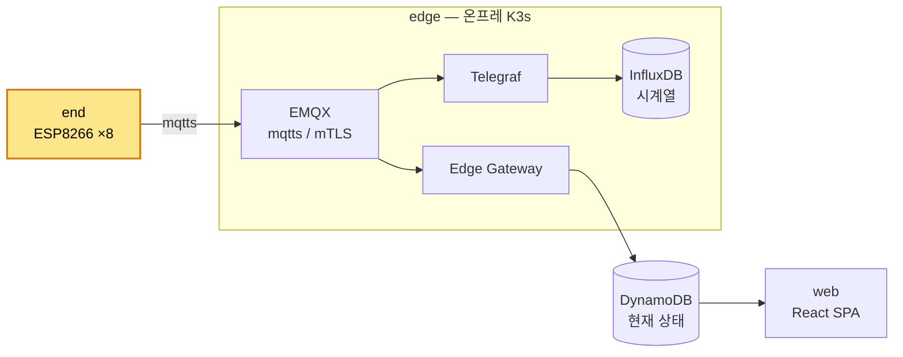

# end

ESP8266 펌웨어. C4001 mmWave 점유 센서 데이터를 mTLS 로 EMQX broker 에 publish 한다.

## 시스템 내 위치



end = 데이터 출발점. step-ca 로 부트스트랩(EST-like)해 디바이스 인증서를 발급받고, mqtts(mTLS)로 `sensors/<cn>/occupancy` 를 주기 publish.

## 디렉토리 구조

```
end/
├── README.md
└── arduino/                 Arduino sketch (폴더 = sketch unit)
    ├── arduino.ino          setup/loop, 모드 분기
    ├── config.h             컴파일 상수 단일 위치 (config.example.h 복사) — WiFi/호스트/토글/센서
    ├── crypto_asn1.{h,cpp}  ASN.1 DER, Base64, PEM↔DER
    ├── crypto_pki.{h,cpp}   RNG, CSR, X5C JWT, leaf notAfter 파스
    ├── fs_store.{h,cpp}     LittleFS wrapper
    ├── stepca.{h,cpp}       /1.0/sign (2단계 발급), /1.0/rekey (mTLS)
    ├── mqtt_session.{h,cpp} EMQX mqtts mTLS publish, 재연결
    ├── wifi_session.{h,cpp} BSSID 회전 + EMQX probe (dead AP 회피)
    ├── sensor.{h,cpp}       C4001 점유 감지·파싱, 파라미터 provision, 페이로드 직렬화
    └── data/                LittleFS 자산 (ca / bootstrap cert·key)
```

## 핵심 흐름

부팅 → WiFi BSSID 선택(associate 후 EMQX TCP probe 로 상위망 검증, dead AP 회전) → NTP 동기(60s, 실패 시 reboot) → 모드 분기.

| 모드 | 진입 | 흐름 |
|---|---|---|
| BOOTSTRAP | device cert 없음 + bootstrap cert 있음 | 2단계 X5C 발급(device-bootstrap→device-renewal) → 센서 파라미터 1회 provision → reboot |
| RENEW | 정식 cert 만료 임박 (`RENEW_BEFORE_SEC`) | `/1.0/rekey` mTLS → OPERATIONAL fallthrough |
| OPERATIONAL | 정식 cert 유효 | EMQX mqtts 연결, `PUBLISH_INTERVAL_MS` 마다 occupancy publish |
| FAIL | 인증서 자산 부재 | 멈춤 — 재플래시 필요 |

- **mTLS**: BearSSL + uECC(P-256 키 생성) + 자체 ASN.1 CSR. 정식 cert 수신 후 bootstrap 자산 즉시 삭제.
- **WiFi 회복**: dead BSSID 는 RTC blacklist, mqtt 장기 실패 시 watchdog soft reboot(reboot 전 랜덤 지터로 herd 분산).
- **센서**: DFRobot C4001 24GHz mmWave, SoftwareSerial `$DFHPD` 프레임 → occupancy(0/1). 파라미터는 부트스트랩 직후 센서 flash 에 영구저장.

## 사전 작업

1. `arduino/config.example.h` → `arduino/config.h` 복사 후 환경값(WiFi, 호스트 IP/포트) 입력.
2. `arduino/data/` 에 인증서 자산 3개 배치 (생성 절차 → [context/knowledge/step-ca.md](../context/knowledge/step-ca.md)):

| 파일 | 출처 |
|---|---|
| `ca-cert.pem` | step-ca Root CA |
| `bootstrap-cert.pem` | 공통 bootstrap leaf (Bootstrap CA 서명) |
| `bootstrap-key.pem` | 위 cert 의 priv key (P-256 평문 PEM) |

<details>
<summary>방별 센서 파라미터 (config.h 채울 때 참고)</summary>

| room | ks | ts | l_on | l_off | r_min | r_max | r_trig |
|------|:--:|:--:|:----:|:-----:|:-----:|:-----:|:------:|
| room_a_1_lounge    | 3 | 3 | 1 | 5  | 0.3 | 4.2 | 4.2 |
| room_a_1_community | 5 | 7 | 1 | 10 | 0.3 | 7.0 | 7.0 |
| room_a_2_lounge    | 5 | 7 | 1 | 10 | 0.3 | 6.3 | 6.3 |
| room_a_3_lounge1   | 5 | 7 | 1 | 10 | 0.3 | 6.3 | 6.3 |
| room_a_3_lounge2   | 3 | 3 | 1 | 5  | 0.3 | 6.3 | 6.3 |
| room_b_1_store     | 5 | 7 | 1 | 10 | 0.3 | 4.5 | 4.5 |
| room_b_2_meeting   | 3 | 3 | 1 | 5  | 0.3 | 8.0 | 8.0 |
| room_b_3_meeting   | 5 | 7 | 1 | 5  | 0.3 | 5.0 | 5.0 |

- 순서 = `config.h` `SENSOR_*` 적용순: `{keep_sens, trig_sens, lat_on, lat_off, r_min, r_max, r_trig}`
- 민감도 0~9(낮을수록 둔감) · lat 초 · r 미터(min≥0.3, max≤20, trig≈max)
- 적용: device cert 삭제 후 재부팅(재부트스트랩) 또는 재플래시 → provision 시 센서 flash 에 1회 기록.
</details>

## 배포 / 실행

Arduino IDE 2.3+ 와 라이브러리: ESP8266 board package(BearSSL/LittleFS 포함), uECC(Kenneth MacKay), PubSubClient(Nick O'Leary), arduino-littlefs-upload 1.6.3+.

빌드 옵션: Board = NodeMCU 1.0 (ESP-12E), Flash = 4MB(FS 1MB), lwIP = v2 Lower Memory.

배선 (C4001 ↔ NodeMCU):

| C4001 | ESP8266 | 비고 |
|---|---|---|
| TX | GPIO13 (D7) | TX↔RX 크로스 |
| RX | GPIO14 (D5) | |
| VCC / GND | VIN(3.3V) / GND | 로직 3.3V, 레벨시프터 불필요 |

절차: ① `data/` 에 자산 배치 → ② 보드/포트 선택 → ③ Tools → "LittleFS Data Upload" → ④ Sketch → Upload.

> 전체 상수는 `config.h`(= `config.example.h`) 단일 위치. 환경 변경 시 이 파일만 수정.

## 더 읽기

- 결정사항(ADR): [docs/architecture/end/firmware.md](../docs/architecture/end/firmware.md)
- step-ca / X5C provisioner: [context/knowledge/step-ca.md](../context/knowledge/step-ca.md)
- security / messaging phase: [docs/architecture/edge/security.md](../docs/architecture/edge/security.md), [messaging.md](../docs/architecture/edge/messaging.md)
- WiFi 회복 설계: [docs/troubleshooting/260611_sensor-dropout-wifi-bssid-recovery](../docs/troubleshooting/260611_sensor-dropout-wifi-bssid-recovery/README.md)
- 전체 시스템: [README.md](../README.md)
