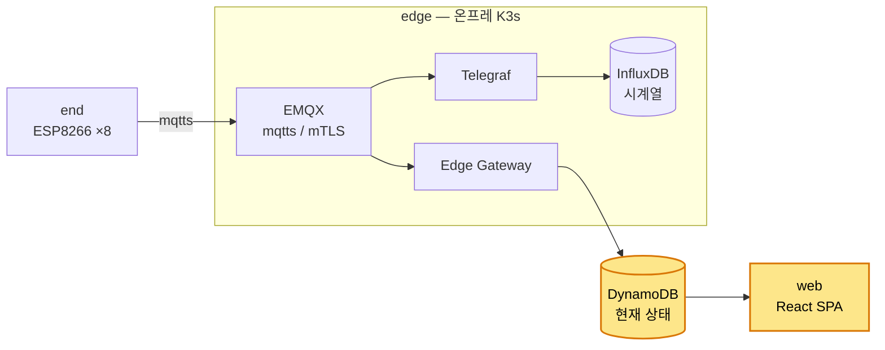

# web

gikview 웹 서비스. 사용자에게 방 점유 상태를 실시간 전달한다. AWS API Gateway WebSocket + Lambda + DynamoDB 서버리스 백엔드 + React SPA.

## 시스템 내 위치



web = 사용자 인터페이스. OIDC(PKCE)로 gist구성원을 인증하고, 인증된 사용자에게 edge 가 쓴 DynamoDB 상태를 WebSocket 으로 push 해 전달한다. 별도 서버는 없으며 가용성은 aws가 관리한다.

## 디렉토리 구조

```
web/
├── backend/     Lambda 3종 소스 (authorizer / handler / broadcast) — 단일 zip, 핸들러 attribute 분기
└── frontend/    React + Vite SPA. OIDC PKCE 인증 + WebSocket 실시간 맵 (src/services, src/components)
```

## 핵심 흐름

- **인증**: 프론트가 gistory IdP 에 OIDC PKCE → access_token. WS `$connect` 시 authorizer Lambda 가 IdP userinfo 로 검증(opaque token).
- **실시간 push**: edge 가 DynamoDB `gikview-rooms` upsert → Streams → broadcast Lambda → 전 WS 연결에 rooms 전체 맵 push.
- **초기 상태 pull**: 프론트 `getState` route → handler 가 rooms scan → 해당 연결에만 push.
- **demand 관측**: handler 가 `$connect` 를 카운터 테이블에 누적 → edge `web-metrics-exporter` 가 Prometheus 로 재노출(web-visibility).

## 사전 작업

인프라팀 1회, AWS. 상세는 [context/knowledge/aws-resources.md](../context/knowledge/aws-resources.md).

| 분류 | 내용 |
|---|---|
| API | API Gateway WebSocket + route(`$connect`/`$disconnect`/`ping`/`getState`) + authorizer 연결 |
| 데이터 | DynamoDB `gikview-rooms-{stage}` / `gikview-connections-{stage}` / `gikview-metrics-{stage}` |
| 프론트 호스팅 | S3 + CloudFront + ACM |
| 인증 | gistory OIDC IdP trust(client 등록, redirect URI) |
| CI/CD | GitHub OIDC federated IAM role(backend/frontend) + Actions secrets |

## 배포 / 실행

- **GitHub Actions CI/CD**, 브랜치 = 환경 (`main`=prod, `dev`=dev).
  - backend: Backend CI → Backend CD (Lambda zip → S3 → 함수 업데이트)
  - frontend: Frontend CI → Frontend CD (`vite build` → S3 sync → CloudFront invalidation)
- 로컬 프론트 개발: `cd web/frontend && npm install && npm run dev`.

## 더 읽기

- 아키텍처 결정(ADR): [docs/architecture/web/](../docs/architecture/web/) (`backend`/`frontend`/`visibility`)
- 구현 명세(SoT): [context/phases/](../context/phases/) (`web-*.md`)
- 웹 세부 스펙: [context/knowledge/front-back-spec.md](../context/knowledge/front-back-spec.md)
- AWS 카탈로그: [context/knowledge/aws-resources.md](../context/knowledge/aws-resources.md)
- backend 소스 상세: [web/backend/README.md](backend/README.md)
- 전체 시스템: [README.md](../README.md)
